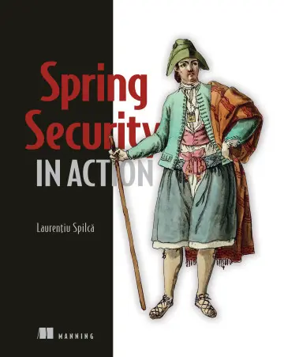

## Chapter 16 : GLOBAL METHOD SECURITY: PRE- AND POSTAUTHORIZATIONS 
 

[Amazon](https://www.amazon.com/Spring-Security-Action-Laurentiu-Spilca/dp/1617297739) | [Manning](https://www.manning.com/books/spring-security-in-action) | [YouTube](https://t.co/4Or4P12LH2?amp=1) | [Books](https://laurspilca.com/books/) | [livebook](https://livebook.manning.com/book/spring-security-in-action) 

### 16.1 Enabling global method security

* ***Call authorization***—Decides whether someone can call a method according to
some implemented privilege rules (preauthorization) or if someone can access
what the method returns after the method executes (postauthorization).

* ***Filtering***—Decides what a method can receive through its parameters (prefiltering)
and what the caller can receive back from the method after the method
executes (postfiltering). We’ll discuss and implement filtering in chapter 17.