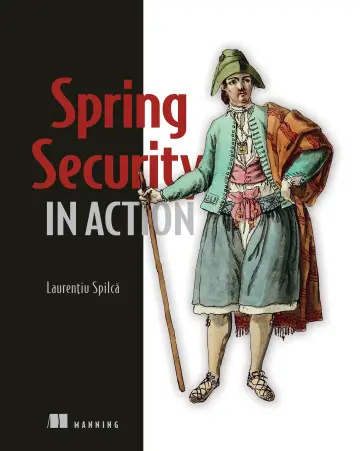

* [https://github.com/robert0714/spring_security_in_action_2020/tree/master/ssia-ch16-ex5](https://github.com/robert0714/spring_security_in_action_2020/tree/master/ssia-ch16-ex5)
*  [https://livebook.manning.com/book/spring-security-in-action/chapter-16/128] (https://livebook.manning.com/book/spring-security-in-action/chapter-16/128) 

## Chapter 16 : GLOBAL METHOD SECURITY: PRE- AND POSTAUTHORIZATIONS 
 

[Amazon](https://www.amazon.com/Spring-Security-Action-Laurentiu-Spilca/dp/1617297739) | [Manning](https://www.manning.com/books/spring-security-in-action) | [YouTube](https://t.co/4Or4P12LH2?amp=1) | [Books](https://laurspilca.com/books/) | [livebook](https://livebook.manning.com/book/spring-security-in-action) 


Global method security offers us three approaches to define the authorization rules that we discuss in this chapter:

* The pre-/postauthorization annotations
* The JSR 250 annotation, @RolesAllowed
* The @Secured annotation
 
### 16.4 Implementing permissions for methods

**Page 408**, 
In a similar manner, you can use the second ***PermissionEvaluator*** method to write
your authorization expression. The second method refers to using an identifier and
subject type instead of the object itself. For example, say that we want to change the
current example to apply the authorization rules before the method is executed,
using ***@PreAuthorize***. In this case, we don’t have the returned object yet. But instead
of having the object itself, we have the document’s code, which is its unique identifier.
Listing 16.19 shows you how to change the permission evaluator class to implement
this scenario. I separated the examples in a project named ssia-ch16-ex5, which you
can run individually.

```java
@Component
public class DocumentsPermissionEvaluator
        implements PermissionEvaluator {

    @Autowired
    private DocumentRepository documentRepository;

    @Override
    public boolean hasPermission(Authentication authentication,
                                 Object target,
                                 Object permission) {
        //No longer defines the authorization rules through the first method.
        return false;
    }

    @Override
    public boolean hasPermission(Authentication authentication,
                                 Serializable targetId,
                                 String targetType,
                                 Object permission) {
        //Instead of having the object, we have its ID, and we get the object using the ID.
        String code = targetId.toString();
        Document document = documentRepository.findDocument(code);

        String p = (String) permission;

        //If the user is an admin or the owner of the document, the user can access the document.
        boolean admin =
                authentication.getAuthorities()
                        .stream()
                        .anyMatch(a -> a.getAuthority().equals(p));

        return admin || document.getOwner().equals(authentication.getName());
    }
}
```

Of course, we also need to use the proper call to the permission evaluator with the
***@PreAuthorize*** annotation. In the following listing, you find the change I made in
the ***DocumentService*** class to apply the authorization rules with the new method.

```java
@Service
public class DocumentService {

    @Autowired
    private DocumentRepository documentRepository;

    //Applies the preauthorization rules by using the second method of the permission evaluator
    @PreAuthorize("hasPermission(#code, 'document', 'ROLE_admin')")
    public Document getDocument(String code) {
        return documentRepository.findDocument(code);
    }
}
```

You can rerun the application and check the behavior of the endpoint. You should see
the same result as in the case where we used the first method of the permission evaluator
to implement the authorization rules. The user Natalie is an admin and can
access details of any document, while the user Emma can only access the documents
she owns. Calling the endpoint for a document that belongs to Natalie and authenticating
with the user "natalie", we issue this command:
```bash
curl -u natalie:12345 http://localhost:8080/documents/abc123 |jq "."
```

The response body is
```json
{
"owner":"natalie"
}
```

Calling the endpoint for a document that belongs to Emma and authenticating with
the user "natalie", we issue this command:
```bash
curl -u natalie:12345 http://localhost:8080/documents/asd555 |jq "."
```

The response body is
```json
{
"owner":"emma"
}
```
Calling the endpoint for a document that belongs to Emma and authenticating with
the user "emma", we issue this command:
```bash
curl -u emma:12345 http://localhost:8080/documents/asd555 |jq "."
```

The response body is
```json
{
"owner":"emma"
}
```

Calling the endpoint for a document that belongs to Natalie and authenticating with
the user "emma", we issue this command:
```bash
curl -u emma:12345 http://localhost:8080/documents/abc123 |jq "."
```

The response body is
```json
{
  "timestamp": "2021-06-09T08:15:46.466+00:00",
  "status": 403,
  "error": "Forbidden",
  "message": "",
  "path": "/documents/abc123"
}
```