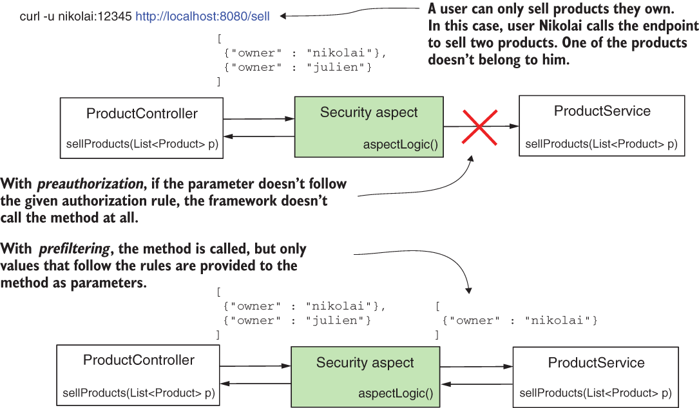

## Chapter 17 : GLOBAL METHOD SECURITY: PRE- AND POSTFILTERING
 

[Amazon](https://www.amazon.com/Spring-Security-Action-Laurentiu-Spilca/dp/1617297739) | [Manning](https://www.manning.com/books/spring-security-in-action) | [YouTube](https://t.co/4Or4P12LH2?amp=1) | [Books](https://laurspilca.com/books/) | [livebook](https://livebook.manning.com/book/spring-security-in-action) 

Suppose you don’t want to forbid the call to a method, but you want to make sure
that the parameters sent to it follow some rules. Or, in another scenario, you want
to make sure that after someone calls the method, the method’s caller only receives
an authorized part of the returned value. We name such a functionality filtering,
and we classify it in two categories:
* ***Prefiltering***—The framework filters the values of the parameters before calling
the method.
* ***Postfiltering***—The framework filters the returned value after the method call.

| Figure 17.1 The client calls the endpoint providing a value that doesn’t follow the authorization rule. With preauthorization, the method isn’t called at all and the caller receives an exception. With prefiltering, the aspect calls the method but only provides the values that follow the given rules. |
|-----------|
|  |

Filtering works differently than call authorization (figure 17.1). With filtering, the
framework executes the call and doesn’t throw an exception if a parameter or
returned value doesn’t follow an authorization rule you define. Instead, it filters out
elements that don’t follow the conditions you specify.

It’s important to mention from the beginning that you can only apply filtering to
collections and arrays. You use prefiltering only if the method receives as a parameter
an array or a collection of objects. The framework filters this collection or array
according to rules you define. Same for postfiltering: you can only apply this approach
if the method returns a collection or an array. The framework filters the value the
method returns based on rules you specify.

