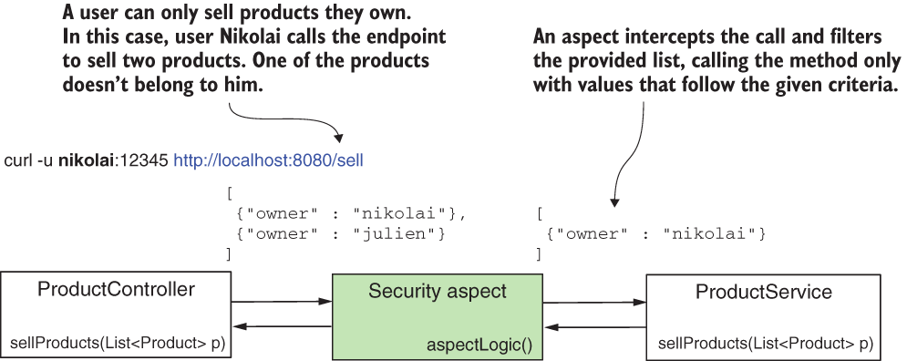
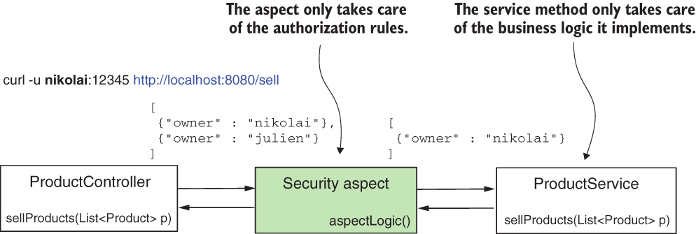
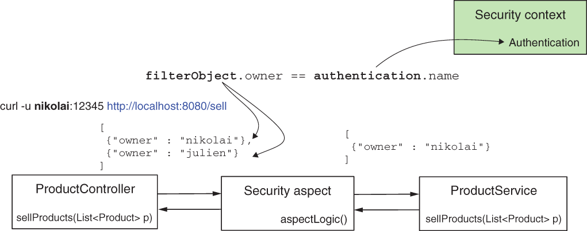
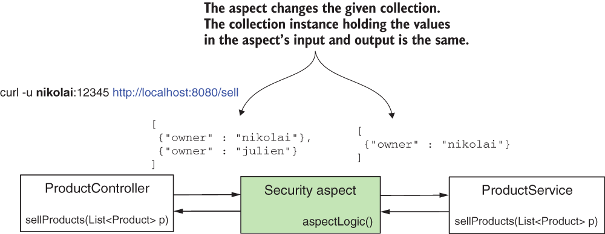

* [https://github.com/robert0714/spring_security_in_action_2020/tree/master/ssia-ch17-ex1](https://github.com/robert0714/spring_security_in_action_2020/tree/master/ssia-ch17-ex1)
*  [https://livebook.manning.com/book/spring-security-in-action/chapter-17/10](https://livebook.manning.com/book/spring-security-in-action/chapter-17/30) 
## Chapter 17 : GLOBAL METHOD SECURITY: PRE- AND POSTFILTERING
 

[Amazon](https://www.amazon.com/Spring-Security-Action-Laurentiu-Spilca/dp/1617297739) | [Manning](https://www.manning.com/books/spring-security-in-action) | [YouTube](https://t.co/4Or4P12LH2?amp=1) | [Books](https://laurspilca.com/books/) | [livebook](https://livebook.manning.com/book/spring-security-in-action) 

We name such a functionality filtering,
and we classify it in two categories:
* ***Prefiltering***—The framework filters the values of the parameters before calling
the method.
* ***Postfiltering***—The framework filters the returned value after the method call.

### 17.1 Applying prefiltering for method authorization   

In this section, we discuss the mechanism behind prefiltering, and then we implement
prefiltering in an example. You can use filtering to instruct the framework to validate
values sent via the method parameters when someone calls a method. The framework
filters values that don’t match the given criteria and calls the method only with values
that do match the criteria. We name this functionality ***prefiltering*** (figure 17.2).

| Figure 17.2 With prefiltering, an aspect intercepts the call to the protected method. The aspect filters the values that the caller provides as the parameter and sends to the method only values that follow the rules you define. |
|-----------|
|  |

You find requirements in real-world examples where prefiltering applies well
because it decouples authorization rules from the business logic the method implements.
Say you implement a use case where you process only specific details that are
owned by the authenticated user. This use case can be called from multiple places.
Still, its responsibility always states that only details of the authenticated user can be
processed, regardless of who invokes the use case. Instead of making sure the invoker
of the use case correctly applies the authorization rules, you make the case apply its
own authorization rules. Of course, you might do this inside the method. But decoupling
authorization logic from business logic enhances the maintainability of your
code and makes it easier for others to read and understand it.

As in the case of call authorization, which we discussed in chapter 16, Spring Security
also implements filtering by using aspects. Aspects intercept specific method calls
and can augment them with other instructions. For prefiltering, an aspect intercepts
methods annotated with the ***@PreFilter*** annotation and filters the values in the collection
provided as a parameter according to the criteria you define (figure 17.3).

| Figure 17.3 With prefiltering, we decouple the authorization responsibility from the business implementation. The aspect provided by Spring Security only takes care of the authorization rules, and the service method only takes care of the business logic of the use case it implements. |
|-----------|
|  |

Similar to the ***@PreAuthorize*** and ***@PostAuthorize*** annotations we discussed in
chapter 16, you set authorization rules as the value of the ***@PreFilter*** annotation. In
these rules, which you provide as SpEL expressions, you use ***filterObject*** to refer
to any element inside the collection or array that you provide as a parameter to the
method.

To see prefiltering applied, let’s work on a project. I named this project ssia-ch17-
ex1. Say you have an application for buying and selling products, and its backend
implements the endpoint /sell. The application’s frontend calls this endpoint when a
user sells a product. But the logged-in user can only sell products they own. Let’s
implement a simple scenario of a service method called to sell the products received
as a parameter. With this example, you learn how to apply the @PreFilter annotation,
as this is what we use to make sure that the method only receives products owned
by the currently logged-in user.

Once we create the project, we write a configuration class to make sure we have a
couple of users to test our implementation. You find the straightforward definition of
the configuration class in listing 17.1. The configuration class that I call ***ProjectConfig*** only declares a ***UserDetailsService*** and a PasswordEncoder, and I
annotate it with ***@GlobalMethodSecurity(prePostEnabled=true)***. For the filtering
annotation, we still need to use the ***@GlobalMethodSecurity*** annotation and
enable the pre-/postauthorization annotations. The provided ***UserDetailsService***
defines the two users we need in our tests: Nikolai and Julien.

```java
@Configuration
@EnableGlobalMethodSecurity(prePostEnabled = true)
public class ProjectConfig {

    @Bean
    public UserDetailsService userDetailsService() {
        var uds = new InMemoryUserDetailsManager();

        var u1 = User.withUsername("nikolai")
                .password("12345")
                .authorities("read")
                .build();

        var u2 = User.withUsername("julien")
                .password("12345")
                .authorities("write")
                .build();

        uds.createUser(u1);
        uds.createUser(u2);

        return uds;
    }

    @Bean
    public PasswordEncoder passwordEncoder() {
        return NoOpPasswordEncoder.getInstance();
    }
}
```
I describe the product using the model class you find in the next listing.
```java
public class Product {

  private String name;
  private String owner; //  The attribute owner has the value of the username.

  // Omitted constructor, getters, and setters
}
```
The ***ProductService*** class defines the service method we protect with @PreFilter.You can find the ***ProductService*** class in listing 17.3. In that listing, before the sellProducts() method, you can observe the use of the ***@PreFilter*** annotation. The Spring Expression Language (SpEL) used with the annotation is ***filterObject.owner == authentication.name***, which allows only values where the owner attribute of the Product equals the username of the logged-in user. On the left side of the equals operator in the SpEL expression; we use ***filterObject***. With ***filterObject***, we refer to objects in the list as parameters. Because we have a list of products, the ***filterObject*** in our case is of type Product. For this reason, we can refer to the product’s owner attribute. On the right side of the equals operator in the expression; we use the authentication object. For the ***@PreFilter*** and ***@PostFilter*** annotations, we can directly refer to the authentication object, which is available in the ***SecurityContext*** after authentication (figure 17.4).

| Figure 17.4 When using prefiltering by ***filterObject***, we refer to the objects inside the list that the caller provides as a parameter. The authentication object is the one stored after the authentication process in the security context. |
|-----------|
|  |

The service method returns the list exactly as the method receives it. This way, we can
test and validate that the framework filtered the list as we expected by checking the list
returned in the HTTP response body.

```java
@Service
public class ProductService {

    //The list given as a parameter allows only products owned by the authenticated user.
    @PreFilter("filterObject.owner == authentication.name")
    public List<Product> sellProducts(List<Product> products) {
        // sell products and return the sold products list
        //Returns the products for test purposes
        return products;
    }
}
```
To make our tests easier, I define an endpoint to call the protected service method.
Listing 17.4 defines this endpoint in a controller class called ***ProductController***.
Here, to make the endpoint call shorter, I create a list and directly provide it as a
parameter to the service method. In a real-world scenario, this list should be provided
by the client in the request body. You can also observe that I use ***@GetMapping*** for an
operation that suggests a mutation, which is non-standard. But know that I do this to
avoid dealing with CSRF protection in our example, and this allows you to focus on
the subject at hand. You learned about CSRF protection in chapter 10.

```java
@RestController
public class ProductController {

    @Autowired
    private ProductService productService;

    @GetMapping("/sell")
    public List<Product> sellProduct() {
        List<Product> products = new ArrayList<>();

        products.add(new Product("beer", "nikolai"));
        products.add(new Product("candy", "nikolai"));
        products.add(new Product("chocolate", "julien"));

        return productService.sellProducts(products);
    }
}
```

Let’s start the application and see what happens when we call the /sell endpoint.
Observe the three products from the list we provided as a parameter to the service
method. I assign two of the products to user Nikolai and the other one to user Julien.
When we call the endpoint and authenticate with user Nikolai, we expect to see in the
response only the two products associated with her. When we call the endpoint and we
authenticate with Julien, we should only find in the response the one product associated
with Julien. In the following code snippet, you find the test calls and their results.
To call the endpoint /sell and authenticate with user Nikolai, use this command:
```bash
curl -u nikolai:12345 http://localhost:8080/sell |jq "."
```
The response body is
```json
[
  {
    "name": "beer",
    "owner": "nikolai"
  },
  {
    "name": "candy",
    "owner": "nikolai"
  }
]
```

To call the endpoint /sell and authenticate with user Julien, use this command:
```bash
curl -u julien:12345 http://localhost:8080/sell|jq "."
```

The response body is
```json
[
  {
    "name": "chocolate",
    "owner": "julien"
  }
]
```
What you need to be careful about is the fact that the aspect changes the given collection.
In our case, don’t expect it to return a new ***List*** instance. In fact, it’s the same
instance from which the aspect removed the elements that didn’t match the given criteria.
This is important to take into consideration. You must always make sure that the
collection instance you provide is not immutable. Providing an immutable collection
to be processed results in an exception at execution time because the filtering aspect
won’t be able to change the collection’s contents (figure 17.5).

| Figure 17.5 The aspect intercepts and changes the collection given as the parameter. You need to provide a mutable instance of a collection so the aspect can change it. |
|-----------|
|  |


**Page 420**, 
Listing 17.5 presents the same project we worked on earlier in this section, but I
changed the ***List*** definition with an immutable instance as returned by the
***List.of()*** method to test what happens in this situation.
```java
@RestController
public class ProductController {

    @Autowired
    private ProductService productService;

    @GetMapping("/sell")
    public List<Product> sellProduct() {
        List<Product> products = List.of(
                new Product("beer", "nikolai"),
                new Product("candy", "nikolai"),
                new Product("chocolate", "julien"));

        return productService.sellProducts(products);
    }
}


```
