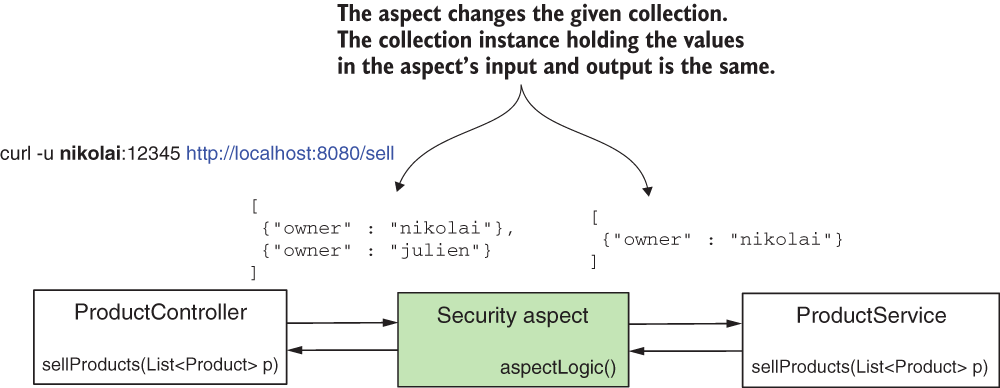

* [https://github.com/robert0714/spring_security_in_action_2020/tree/master/ssia-ch17-ex2](https://github.com/robert0714/spring_security_in_action_2020/tree/master/ssia-ch17-ex2)
*  [https://livebook.manning.com/book/spring-security-in-action/chapter-17/10](https://livebook.manning.com/book/spring-security-in-action/chapter-17/30) 
## Chapter 17 : GLOBAL METHOD SECURITY: PRE- AND POSTFILTERING
 

[Amazon](https://www.amazon.com/Spring-Security-Action-Laurentiu-Spilca/dp/1617297739) | [Manning](https://www.manning.com/books/spring-security-in-action) | [YouTube](https://t.co/4Or4P12LH2?amp=1) | [Books](https://laurspilca.com/books/) | [livebook](https://livebook.manning.com/book/spring-security-in-action) 

We name such a functionality filtering,
and we classify it in two categories:
* ***Prefiltering***—The framework filters the values of the parameters before calling
the method.
* ***Postfiltering***—The framework filters the returned value after the method call.

### 17.1 Applying prefiltering for method authorization   

| Figure 17.5 The aspect intercepts and changes the collection given as the parameter. You need to provide a mutable instance of a collection so the aspect can change it. |
|-----------|
|  |


**Page 420**, 
Listing 17.5 presents the same project we worked on earlier in this section, but I
changed the ***List*** definition with an immutable instance as returned by the
***List.of()*** method to test what happens in this situation.
```java
@RestController
public class ProductController {

    @Autowired
    private ProductService productService;

    @GetMapping("/sell")
    public List<Product> sellProduct() {

        List<Product> products = List.of(   //List.of() returns an immutable instance of the list.
                new Product("beer", "nikolai"),
                new Product("candy", "nikolai"),
                new Product("chocolate", "julien"));

        return productService.sellProducts(products);
    }
}
```
I separated this example in project ssia-ch17-ex2 folder so that you can test it yourself
as well. Running the application and calling the /sell endpoint results in an HTTP
response with status 500 Internal Server Error and an exception in the console log, as
presented by the next code snippet:

```
curl -u julien:12345 http://localhost:8080/sell |jq "."
```
The response body is:
```json
{
  "status":500,
  "error":"Internal Server Error",
  "message":"No message available",
  "path":"/sell"
}
```

In the application console, you can find an exception similar to the one presented in
the following code snippet:

```
java.lang.UnsupportedOperationException: null
at java.base/java.util.ImmutableCollections.uoe(ImmutableCollections.java:73)
~[na:na]
...
```