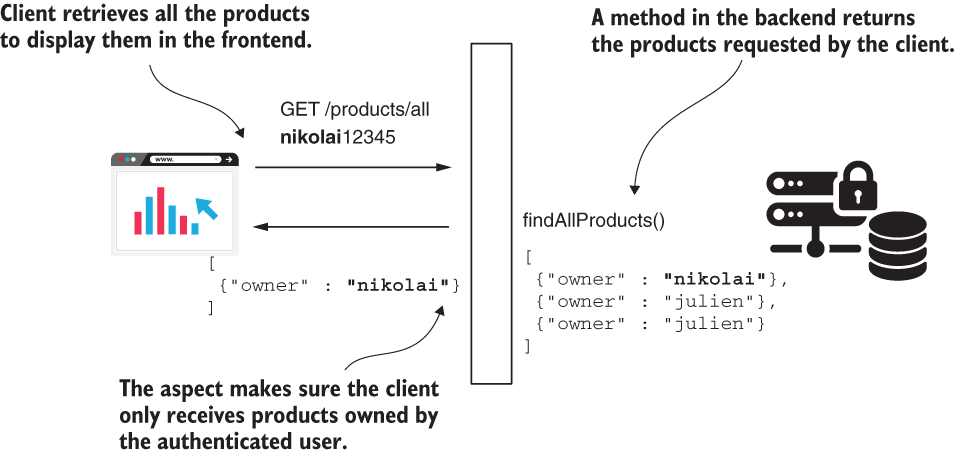
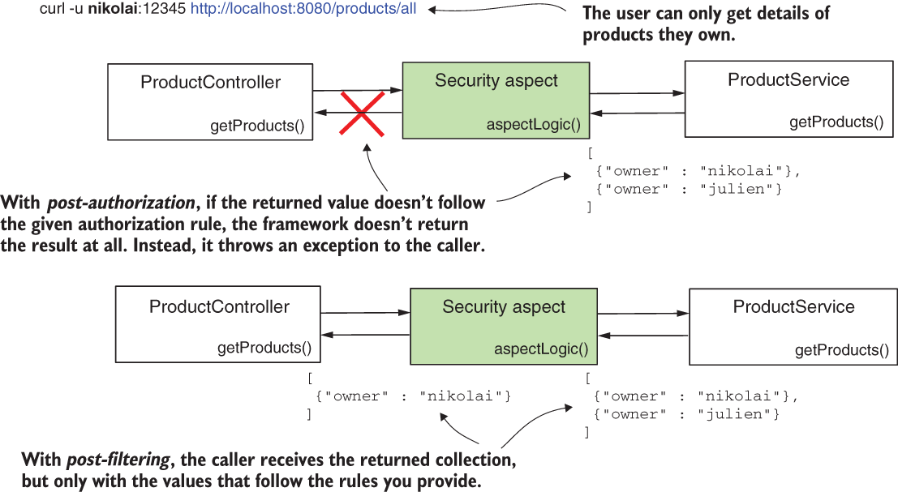
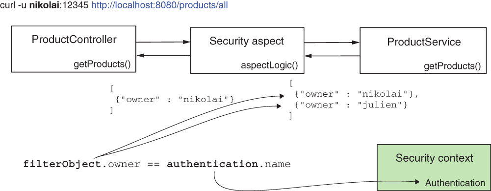

* [https://github.com/robert0714/spring_security_in_action_2020/tree/master/ssia-ch17-ex3](https://github.com/robert0714/spring_security_in_action_2020/tree/master/ssia-ch17-ex3)
*  [https://livebook.manning.com/book/spring-security-in-action/chapter-17/10](https://livebook.manning.com/book/spring-security-in-action/chapter-17/30) 
## Chapter 17 : GLOBAL METHOD SECURITY: PRE- AND POSTFILTERING
 

[Amazon](https://www.amazon.com/Spring-Security-Action-Laurentiu-Spilca/dp/1617297739) | [Manning](https://www.manning.com/books/spring-security-in-action) | [YouTube](https://t.co/4Or4P12LH2?amp=1) | [Books](https://laurspilca.com/books/) | [livebook](https://livebook.manning.com/book/spring-security-in-action) 

We name such a functionality filtering,
and we classify it in two categories:
* ***Prefiltering***—The framework filters the values of the parameters before calling
the method.
* ***Postfiltering***—The framework filters the returned value after the method call.

### 17.2 Applying postfiltering for method authorization

In this section, we implement postfiltering. Say we have the following scenario. An
application that has a frontend implemented in Angular and a Spring-based backend
manages some products. Users own products, and they can obtain details only for
their products. To get the details of their products, the frontend calls endpoints
exposed by the backend (figure 17.6).


| Figure 17.6 Postfiltering scenario. A client calls an endpoint to retrieve data it needs to display
in the frontend. A postfiltering implementation makes sure that the client only gets data owned
by the currently authenticated user. |
|-----------|
|  |

On the backend in a service class the developer wrote a method ***List<Product> findProducts()*** that retrieves the details of products. The client application displays
these details in the frontend. How could the developer make sure that anyone
calling this method only receives products they own and not products owned by others?
An option to implement this functionality by keeping the authorization rules
decoupled from the business rules of the application is called ***postfiltering***. In this section,
we discuss how postfiltering works and demonstrate its implementation in an
application.  

Similar to prefiltering, postfiltering also relies on an aspect. This aspect allows a call to a method, but once the method returns, the aspect takes the returned value and makes sure that it follows the rules you define. As in the case of prefiltering, postfiltering changes a collection or an array returned by the method. You provide the criteria that the elements inside the returned collection should follow. The post-filter aspect filters from the returned collection or array those elements that don’t follow your rules.  

To apply postfiltering, you need to use the ***@PostFilter*** annotation. The ***@PostFilter*** annotation works similar to all the other pre-/post- annotations we used in
chapter 14 and in this chapter. You provide the authorization rule as a SpEL expression
for the annotation’s value, and that rule is the one that the filtering aspect uses as
shown in figure 17.7. Also, similar to prefiltering, postfiltering only works with arrays
and collections. Make sure you apply the ***@PostFilter*** annotation only for methods
that have as a return type an array or a collection.

| Figure 17.7 Postfiltering. An aspect intercepts the collection returned by the protected method and filters the values that don’t follow the rules you provide. Unlike postauthorization, postfiltering doesn’t throw an exception to the caller when the returned value doesn’t follow the authorization rules. |
|-----------|
|  |

Let’s apply postfiltering in an example. I created a project named ssia-ch17-ex3 for
this example. To be consistent, I kept the same users as in our previous examples in
this chapter so that the configuration class won’t change. For your convenience, I
repeat the configuration presented in the following listing.
```java
@Configuration
@EnableGlobalMethodSecurity(prePostEnabled = true)
public class ProjectConfig {

    @Bean
    public UserDetailsService userDetailsService() {
        var uds = new InMemoryUserDetailsManager();

        var u1 = User.withUsername("nikolai")
                .password("12345")
                .authorities("read")
                .build();

        var u2 = User.withUsername("julien")
                .password("12345")
                .authorities("write")
                .build();

        uds.createUser(u1);
        uds.createUser(u2);

        return uds;
    }

    @Bean
    public PasswordEncoder passwordEncoder() {
        return NoOpPasswordEncoder.getInstance();
    }
}
```
The next code snippet shows that the Product class remains unchanged as well:

```java
public class Product {
    private String name;
    private String owner;
    // Omitted constructor, getters, and setters
}
```

In the ***ProductService*** class, we now implement a method that returns a list of
products. In a real-world scenario, we assume the application would read the products
from a database or any other data source. To keep our example short and allow you to
focus on the aspects we discuss, we use a simple collection, as presented in listing 17.7.

I annotate the ***findProducts()*** method, which returns the list of products, with
the ***@PostFilter*** annotation. The condition I add as the value of the annotation,
***filterObject.owner == authentication.name***, only allows products to be
returned that have the owner equal to the authenticated user (figure 17.8). On the
left side of the equals operator, we use ***filterObject*** to refer to elements inside the
returned collection. On the right side of the operator, we use authentication to refer
to the ***Authentication*** object stored in the ***SecurityContext***.

| Figure 17.8 In the SpEL expression used for authorization, we use ***filterObject*** to refer to the objects in the returned collection, and we use ***authentication*** to refer to the ***Authentication*** instance from the security context. |
|-----------|
|  |

```java
@Service
public class ProductService {

  //Adds the filtering condition for the objects in the collection returned by the method
  @PostFilter("filterObject.owner == authentication.name")
  public List<Product> findProducts() {
    List<Product> products = new ArrayList<>();

    products.add(new Product("beer", "nikolai"));
    products.add(new Product("candy", "nikolai"));
    products.add(new Product("chocolate", "julien"));

    return products;
  }
}
```
We define a controller class to make our method accessible through an endpoint. The
next listing presents the controller class.
```java
@RestController
public class ProductController {

  @Autowired
  private ProductService productService;

  @GetMapping("/find")
  public List<Product> findProducts() {
    return productService.findProducts();
  }
}
```
It’s time to run the application and test its behavior by calling the /find endpoint. We
expect to see in the HTTP response body only products owned by the authenticated
user. The next code snippets show the result for calling the endpoint with each of our
users, Nikolai and Julien. To call the endpoint /find and authenticate with user Julien,
use this cURL command:
```bash
curl -u julien:12345 http://localhost:8080/find |jq "."
```

The response body is
```json
[
{"name":"chocolate","owner":"julien"}
]
```

To call the endpoint /find and authenticate with user Nikolai, use this cURL command:

```bash
curl -u nikolai:12345 http://localhost:8080/find |jq "."
```
The response body is
```json
[
{"name":"beer","owner":"nikolai"},
{"name":"candy","owner":"nikolai"}
]
```