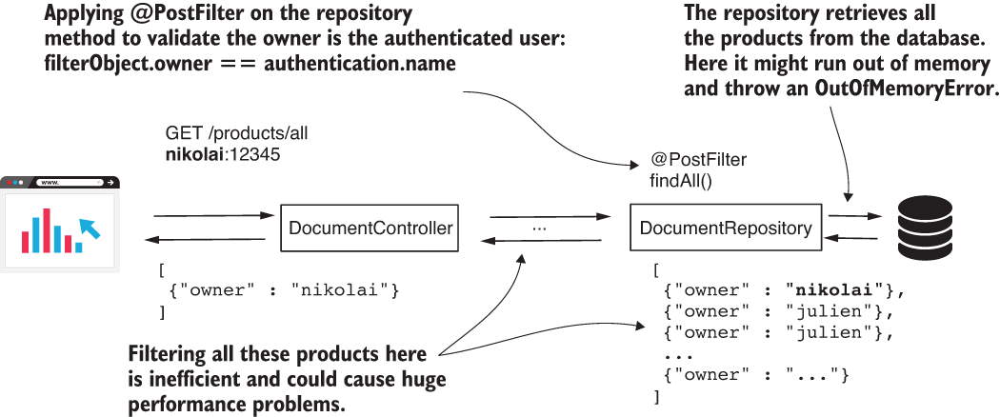
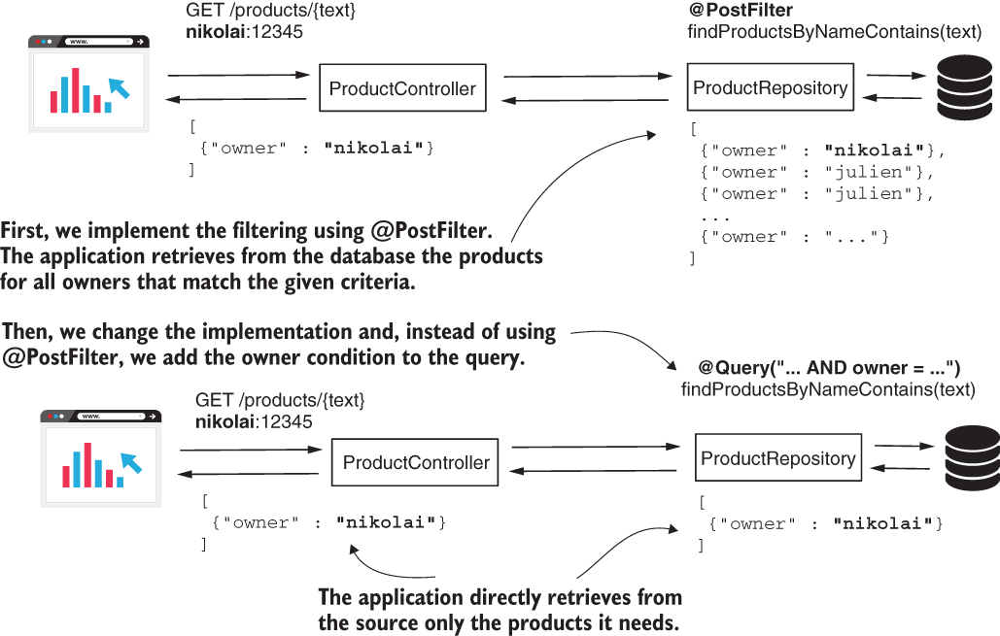

* [https://github.com/robert0714/spring_security_in_action_2020/tree/master/ssia-ch17-ex4](https://github.com/robert0714/spring_security_in_action_2020/tree/master/ssia-ch17-ex4)
*  [https://livebook.manning.com/book/spring-security-in-action/chapter-17/82](https://livebook.manning.com/book/spring-security-in-action/chapter-17/82) 
## Chapter 17 : GLOBAL METHOD SECURITY: PRE- AND POSTFILTERING
 

[Amazon](https://www.amazon.com/Spring-Security-Action-Laurentiu-Spilca/dp/1617297739) | [Manning](https://www.manning.com/books/spring-security-in-action) | [YouTube](https://t.co/4Or4P12LH2?amp=1) | [Books](https://laurspilca.com/books/) | [livebook](https://livebook.manning.com/book/spring-security-in-action) 

We name such a functionality filtering,
and we classify it in two categories:
* ***Prefiltering***—The framework filters the values of the parameters before calling
the method.
* ***Postfiltering***—The framework filters the returned value after the method call.

### 17.3 Using filtering in Spring Data repositories

In this section, we discuss filtering applied with Spring Data repositories. It’s important to understand this approach because we often use databases to persist an application’s data. It is pretty common to implement Spring Boot applications that use Spring Data as a high-level layer to connect to a database, be it SQL or NoSQL. We discuss two approaches for applying filtering at the repository level when using Spring Data, and we implement these with examples.

The first approach we take is the one you learned up to now in this chapter: using the ***@PreFilter*** and ***@PostFilter*** annotations. The second approach we discuss is direct integration of the authorization rules in queries. As you’ll learn in this section, you need to be attentive when choosing the way you apply filtering in Spring Data repositories. As mentioned, we have two options:

* Using ***@PreFilter*** and ***@PostFilter*** annotations
* Directly applying filtering within queries

Using the ***@PreFilter*** annotation in the case of repositories is the same as applying this annotation at any other layer of your application. But when it comes to postfiltering, the situation changes. Using ***@PostFilter*** on repository methods technically works fine, but it’s rarely a good choice from a performance point of view.

Say you have an application managing the documents of your company. The developer needs to implement a feature where all the documents are listed on a web page after the user logs in. The developer decides to use the ***findAll()*** method of the Spring Data repository and annotates it with ***@PostFilter*** to allow Spring Security to filter the documents such that the method returns only those owned by the currently logged-in user. This approach is clearly wrong because it allows the application to retrieve all the records from the database and then filter the records itself. If we have a large number of documents, calling ***findAll()*** without pagination could directly lead to an ***OutOfMemoryError***. Even if the number of documents isn’t big enough to fill the heap, it’s still less performant to filter the records in your application rather than retrieving at the start only what you need from the database (figure 17.9).

At the service level, you have no other option than to filter the records in the app. Still, if you know from the repository level that you need to retrieve only records owned by the logged-in user, you should implement a query that extracts from the database only the required documents.


| Figure 17.9 The anatomy of a bad design. When you need to apply filtering at the repository level, it’s better to first make sure you only retrieve the data you need. Otherwise, your application can face heavy memory and performance issues. |
|-----------|
|  |
*  ***NOTE***  In any situation in which you retrieve data from a data source, be it a database, a web service, an input stream, or anything else, make sure the application retrieves only the data it needs. Avoid as much as possible the need to filter data inside the application.

Let’s work on an application where we first use the ***@PostFilter*** annotation on the Spring Data repository method, and then we change to the second approach where we write the condition directly in the query. This way, we have the opportunity to experiment with both approaches and compare them.

I created a new project named ssia-ch17-ex4, where I use the same configuration class as for our previous examples in this chapter. As in the earlier examples, we write an application managing products, but this time we retrieve the product details from a table in our database. For our example, we implement a search functionality for the products (figure 17.10). We write an endpoint that receives a string and returns the list of products that have the given string in their names. But we need to make sure to return only products associated with the authenticated user.

We use Spring Data JPA to connect to a database. For this reason, we also need to add to the pom.xml file the ***spring-boot-starter-data-jpa*** dependency and a connection driver according to your database management server technology. The next code snippet provides the dependencies I use in the pom.xml file:
```xml
<dependency>
   <groupId>org.springframework.boot</groupId>
   <artifactId>spring-boot-starter-data-jpa</artifactId>
</dependency>
<dependency>
   <groupId>org.springframework.boot</groupId>
   <artifactId>spring-boot-starter-security</artifactId>
</dependency>
<dependency>
   <groupId>org.springframework.boot</groupId>
   <artifactId>spring-boot-starter-web</artifactId>
</dependency>
<dependency>
   <groupId>mysql</groupId>
   <artifactId>mysql-connector-java</artifactId>
   <scope>runtime</scope>
</dependency>
```

| Figure 17.10 In our scenario, we start by implementing the application using @PostFilter to filter products based on their owner. Then we change the implementation to add the condition directly on the query. This way, we make sure the application only gets from the source the needed records. |
|-----------|
|  |

In the application.properties file, we add the properties Spring Boot needs to create the data source. In the next code snippet, you find the properties I added to my application.properties file:
```properties
spring.datasource.url=jdbc:mysql://localhost/spring?useLegacyDatetimeCode=false&serverTimezone=UTC
spring.datasource.username=root
spring.datasource.password=
spring.datasource.initialization-mode=always
```
We also need a table in the database for storing the product details that our application retrieves. We define a schema.sql file where we write the script for creating the table, and a data.sql file where we write queries to insert test data in the table. You need to place both files (schema.sql and data.sql) in the resources folder of the Spring Boot project so they will be found and executed at the start of the application. The next code snippet shows you the query used to create the table, which we need to write in the schema.sql file:

```sql
CREATE TABLE IF NOT EXISTS `spring`.`product` (
    `id` INT NOT NULL AUTO_INCREMENT,
    `name` VARCHAR(45) NULL,
    `owner` VARCHAR(45) NULL,
    PRIMARY KEY (`id`));
```

In the data.sql file, I write three INSERT statements, which the next code snippet presents.
These statements create the test data that we need later to prove the application’s
behavior.
```sql
INSERT IGNORE INTO `spring`.`product` (`id`, `name`, `owner`) VALUES ('1','beer', 'nikolai');
INSERT IGNORE INTO `spring`.`product` (`id`, `name`, `owner`) VALUES ('2','candy', 'nikolai');
INSERT IGNORE INTO `spring`.`product` (`id`, `name`, `owner`) VALUES ('3','chocolate', 'julien');
```

* ***NOTE*** Remember, we used the same names for tables in other examples throughout the book. If you already have tables with the same names from
previous examples, you should probably drop those before starting with this project. An alternative is to use a different schema.


To map the product table in our application, we need to write an entity class. The following listing defines the ***Product*** entity.
```java
@Entity
public class Product {

    @Id
    @GeneratedValue(strategy = GenerationType.IDENTITY)
    private int id;
    private String name;
    private String owner;

    // Omitted getters and setters
}
```

For the ***Product*** entity, we also write a Spring Data repository interface defined in the next listing. Observe that this time we use the ***@PostFilter*** annotation directly on the method declared by the repository interface.
```java
public interface ProductRepository
        extends JpaRepository<Product, Integer> {

    //Uses the @PostFilter annotation for the method declared by the Spring Data repository
    @PostFilter("filterObject.owner == authentication.name")
    List<Product> findProductByNameContains(String text);
}
```

The next listing shows you how to define a controller class that implements the endpoint we use for testing the behavior.
```java
@RestController
public class ProductController {

  @Autowired
  private ProductRepository productRepository;

  @GetMapping("/products/{text}")
  public List<Product> findProductsContaining(@PathVariable String text) {

    return productRepository.findProductByNameContains(text);
  }
}
```
Starting the application, we can test what happens when calling the /products/{text}
endpoint. By searching the letter c while authenticating with user Nikolai, the HTTP
response only contains the product ***candy***. Even if ***chocolate*** contains a c as well, because
Julien owns it, ***chocolate*** won’t appear in the response. You find the calls and their
responses in the next code snippets. To call the endpoint /products and authenticate
with user Nikolai, issue this command:
```bash
curl -u nikolai:12345 http://localhost:8080/products/c
```
The response body is
```json
[
  {"id":2,"name":"candy","owner":"nikolai"}
]
```

To call the endpoint /products and authenticate with user Julien, issue this command:
```bash
curl -u julien:12345 http://localhost:8080/products/c
```

The response body is
```json
[
  {"id":3,"name":"chocolate","owner":"julien"}
]
```


