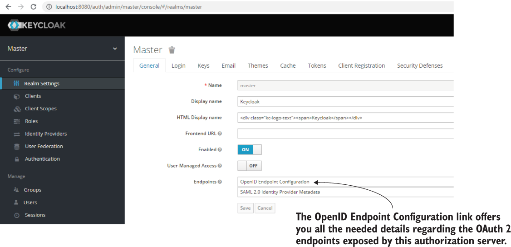
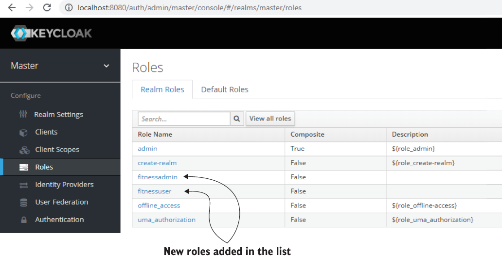

# Chapter 18 : HANDS-ON: AN OAUTH 2 APPLICATION
 
*  [https://livebook.manning.com/book/spring-security-in-action/chapter-18](https://livebook.manning.com/book/spring-security-in-action/chapter-18) 

[Amazon](https://www.amazon.com/Spring-Security-Action-Laurentiu-Spilca/dp/1617297739) | [Manning](https://www.manning.com/books/spring-security-in-action) | [YouTube](https://t.co/4Or4P12LH2?amp=1) | [Books](https://laurspilca.com/books/) | [livebook](https://livebook.manning.com/book/spring-security-in-action) 


In chapters 12 through 15, we discussed in detail how an OAuth 2 system works and how you implement one with Spring Security. We then changed the subject and in chapters 16 and 17, you learned how to apply authorization rules at any layer of your application using global method security. In this chapter, we’ll combine these two essential subjects and apply global method security within an OAuth 2 resource server.

Besides defining authorization rules at different layers of our resource server implementation, you’ll also learn how to use a tool named Keycloak as the authorization server for your system. The example we’ll work on this chapter is helpful for the following reasons:

* Systems often use third-party tools such as Keycloak in real-world implementations to define an abstraction layer for authentication. There’s a good chance you need to use Keycloak or a similar third-party tool in your OAuth 2 implementation. You’ll find many possible alternatives to ***Keycloak*** like ***Okta***,***Auth0***, and ***LoginRadius***. This chapter focuses on a scenario in which you need to use such a tool in the system you develop.
* In real-world scenarios, we use authorization applied not only for the endpoints but also for other layers of the application. And this also happens for an OAuth 2 system.
* You’ll gain a better understanding of the big picture of the technologies and approaches we discuss. To do this, we’ll once again use an example to reinforce what you learned in chapters 12 through 17.

Let’s dive into the next section and find out the scenario of the application we’ll
implement in this hands-on chapter.

## 18.1 The application scenario
Say we need to build a backend for a fitness application. Besides other great features, 
the app also stores a history of users’ workouts. In this chapter, we’ll focus on the part
of the application that stores the history of workouts. We presume our backend needs
to implement three use cases. For each action defined by the use cases, we have specific
security restrictions (figure 18.1). 

| |
|-----------|
| Figure 18.1 Whether it’s a workout history or a bank account, an application needs to implement proper authorization rules to protect user data from theft or unwanted changes.  |
The three use cases are these:

* ***Add a new workout record for a user***. In a database table named workout, we add a
new record that stores user, the start and the end times of the workout, and the
difficulty of the workout, using an integer on a scale from 1 to 5.
The authorization restriction for this use case asserts that authenticated
users can only add workout records for themselves. The client calls an endpoint
exposed by the resource server to add a new workout record.
* ***Find all the workouts for a user***. The client needs to display a list of workouts in the
user’s history. The client calls an endpoint to retrieve that list.
The authorization restriction in this case states that a user can only get their
own workout records.
* ***Delete a workout***. Any user having the admin role can delete a workout for any
other user. The client calls an endpoint to delete a workout record.
The authorization restriction says that only an admin can delete records.

We need to implement three use cases for which we have two acting roles. The two
roles are the standard user, ***fitnessuser***, and the admin, ***fitnessadmin***. A fitnessuser can
add a workout for themselves and can see their own workout history. A fitnessadmin
can only delete workout records for any user. Of course, an admin can also be a user,
and in this case, they can also add workouts for themselves or see their own recorded
workouts.
The backend that we implement with these three use cases is an OAuth 2 resource
server (figure 18.2). We need an authorization server as well. For this example, we use
a tool named Keycloak to configure the authorization server for the system. Keycloak
offers all possibilities to set our users either locally or by integrating with other user
management services.

| |
|-----------|
| Figure 18.2 The actors in the system are the user, the client, the authorization server, and the resource server. We use Keycloak to configure the authorization server, and we implement the resource server using Spring Security.  |

We start the implementations by configuring a local Keycloak instance as our
authorization server. We then implement the resource server and set up the authorization
rules using Spring Security. Once we have a working application, we test it by calling
the endpoint with cURL.

## 18.2 Configuring Keycloak as an authorization server
[https://livebook.manning.com/book/spring-security-in-action/chapter-18/21](https://livebook.manning.com/book/spring-security-in-action/chapter-18/21)

In this section, we configure Keycloak as the authorization server for the system (figure
18.3). Keycloak is an excellent open source tool designed for identity and access
management. You can download Keycloak from keycloak.org. Keycloak offers the ability
to manage simple users locally and also provides advanced features such as user
federation. You could connect it to your LDAP and Active Directory services or to different
identity providers. For example, you could use Keycloak as a high-level authentication
layer by connecting it to one of the common OAuth 2 providers we discussed
in chapter 12.

| |
|-----------|
| Figure 18.3 As part of the hands-on application we implement in this chapter,we follow three major steps. In this section, we configure Keycloak as the authorization server for the system as the first step.  |

Keycloak’s configuration is flexible, although it can become complex, depending on
what you want to achieve. For this chapter, we discuss only the setup we need to do for
our example. Our setup only defines a few users with their roles. But Keycloak can do much more than this. If you plan to use Keycloak in real-world scenarios, I recommend
you first read the detailed documentation at their official website: https://www.keycloak.org/documentation. In chapter 9 of ***Enterprise Java Microservices*** by Ken
Finnigan (Manning, 2018), you can also find a good discussion on securing microservices
where the author uses Keycloak for user management. Here’s the link:

```
https://livebook.manning.com/book/enterprise-java-microservices/chapter-9
```

(If you enjoy a discussion on microservices, I recommend you read Ken Finnigan’s
entire book. The author provides excellent insights on subjects anyone implementing
microservices with Java should know.)

To install Keycloak, you only need to download an archive containing the latest
version from the official website https://www.keycloak.org/downloads. Then, unzip
the archive in a folder, and you can start Keycloak using the standalone executable
file, which you find in the bin folder. If you’re using Linux, you need to run standalone.
sh. For Windows, you run standalone.bat.

Once you start the Keycloak server, access it in a browser at http://localhost:8080.
In Keycloak’s first page, you configure an admin account by entering a username and
a password (figure 18.4).
| |
|-----------|
| Figure 18.4 To manage Keycloak, you first need to set up your admin credentials. You do this by accessing
Keycloak the first time you start it.  |

| |
|-----------|
| Figure 18.5 Once you set up your admin account, you can log in to Keycloak’s Administration Console using the credentials you just set up.  |

That’s it. You successfully set up your admin credentials. Thereafter, you log in with your credentials to manage Keycloak as presented in figure 18.5.

In the Administration Console, you can start configuring the authorization server. We need to know which OAuth 2–related endpoints Keycloak exposes. You find those endpoints in the General section of the Realm Settings page, which is the first page you land on after logging in to the Administration Console (figure 18.6).

| |
|-----------|
| Figure 18.6 You find the endpoints related to the authorization server by clicking the OpenID Endpoint Configuration link. You need these endpoints to obtain the access token and to configure the resource server.  |

In the next code snippet, I extracted a part of the OAuth 2 configuration that you find
by clicking the OpenID Endpoint Configuration link. This configuration provides the
token endpoint, the authorization endpoint, and the list of supported grant types.
These details should be familiar to you, as we discussed them in chapters 12 through 15.

``` bash
curl -s http://10.100.98.200:8080/auth/realms/master/.well-known/uma2-configuration |jq .
```

The output is as below
```json
{

  "issuer":"http://localhost:8080/auth/realms/master",
  "authorization_endpoint":"http://localhost:8080/auth/realms/master/protocol/openid-connect/auth",
  "token_endpoint":"http://localhost:8080/auth/realms/master/protocol/openid-connect/token",   
  "jwks_uri":"http://localhost:8080/auth/realms/master/protocol/openid-connect/certs",   
  "grant_types_supported":[
      "authorization_code",
      "implicit",
      "refresh_token",
      "password",
      "client_credentials"
   ],
...
}
```

| |
|-----------|
| Figure 18.7 To test the application, we manually generate access tokens, which we use to call the endpoints. If you define a short lifespan for the tokens, you need to generate them more often, and you might get annoyed when a token expires before you can use it.  |

You might find testing the app more comfortable if you configured long-lived access tokens (figure 18.7). However, in a real-world scenario, remember not to give a long lifespan to your tokens. For example, in a production system, a token should expire  within a few minutes. But for testing, you can leave it active for one day. You can change the length of a token’s lifespan from the Tokens tab, shown in figure 18.8.
| |
|-----------|
| Figure 18.8 You might find testing more comfortable if an issued access token doesn’t expire quickly. You can change its lifespan in the Tokens tab.  |

Now that we’ve installed Keycloak, set up the admin credentials, and made a few adjustments, we can configure the authorization server. Here’s a list of the configuration steps.

1. Register a client for the system. An OAuth 2 system needs at least one client recognized
by the authorization server. The client makes authentication requests for
users. In section 18.2.1, you’ll learn how to add a new client registration.
2. Define a client scope. The client scope identifies the purpose of the client in
the system. We use the client scope definition to customize the access tokens
issued by the authorization server. In section 18.2.2, you’ll learn how to add a
client scope, and in section 18.2.4, we’ll configure it to customize the access
token.
3. Add users for our application. To call the endpoints on the resource server, we
need users for our application. You’ll learn how to add users managed by Keycloak
in section 18.2.3.
4. Define user roles and custom access tokens. After adding users, you can issue
access tokens for them. You’ll notice that the access tokens don’t have all the
details we need to accomplish our scenario. You’ll learn how to configure roles
for the users and customize the access tokens to present the details expected by
the resource server we’ll implement using Spring Security in section 18.2.4.

### 18.2.1 Registering a client for our system
In this section, we discuss registering a client when using Keycloak as an authorization
server. Like in any other OAuth 2 system, we need to register the client applications at
the authorization server level. To add a new client, we use Keycloak Administration
Console. As presented in figure 18.9, you find a list of clients by navigating to the Clients
tab on the left-hand menu. From here, you can also add a new client registration.

| |
|-----------|
| Figure 18.9 To add a new client, you navigate to the clients list using the Clients tab on the left-hand menu. Here you can add a new client registration by clicking the Create button in the upper-right corner of the Clients table.  |

I added a new client that I named fitnessapp. This client represents the application allowed to call endpoints from the resource server we’ll implement in section 18.3. Figure 18.10 shows the Add Client form.

| |
|-----------|
| Figure 18.10 When adding a client, you only need to assign it a unique client ID (fitnessapp) and then click Save.  |

### 18.2.2 Specifying client scopes
In this section, we define a scope for the client we registered in section 18.2.1. The client
scope identifies the purpose of the client. We’ll also use client scope in section
18.2.4 to customize the access token issued by Keycloak. To add a scope to the client,
we again use the Keycloak Administration Console. As figure 18.11 presents, you find
a list of client scopes when navigating to the Client Scopes tab from the left-hand
menu. From here, you can also add a new client scope to the list.

| |
|-----------|
| Figure 18.11 For a list of all client scopes, navigate to the Client Scopes tab. Here, you add a new client scope by clicking the Create button on the upper-right corner of the Client Scopes table.  |

For the app that we build in this hands-on example, I added a new client scope named
fitnessapp. When adding a new scope, also make sure that the protocol for which you
set the client scope is ***openid-connect*** (figure 18.12).

| |
|-----------|
| Figure 18.12 When adding a new client scope, give it a unique name and make sure you define it for the desired protocol. In our case, the protocol we want is openid-connect.|


* ***NOTE*** The other protocol you can choose is SAML 2.0. Spring Security previously offered an extension for this protocol that you can still find at https://projects.spring.io/spring-security-saml/#quick-start. We don’t discuss using SAML 2.0 in this book because it’s not actively developed anymore for Spring Security. Also, SAML 2.0 is less frequently encountered than OAuth 2 in applications.

Once you create the new role, you assign it to your client as figure 18.13 presents. You get to this screen by navigating to the Clients menu and then selecting the Client Scopes tab.

| |
|-----------|
| Figure 18.13 Once you have a client scope, you assign it to a client. In this figure, I already moved the scopes I need into the right-hand box named Assigned Default Client Scopes. This way, you can now use the defined scope with a specific client.  |


### 18.2.3 Adding users and obtaining access tokens
In this section, we create and configure users for our application. Previously, we configured
the client and its scope in sections 18.2.1 and 18.2.2. But besides the client
app, we need users to authenticate and access the services offered by our resource
server. We configure three users that we use to test our application (figure 18.14). I
named the users Mary, Bill, and Rachel.

| |
|-----------|
| Figure 18.14 By navigating to the Users tab from the menu on the left, you’ll find a list of all the users for your apps. Here you can also add a new user by clicking Add User in the upper-right corner of the Users table.  |

When adding a new user in the Add User form, give it a unique username and check the box stating the email was verified (figure 18.15). Also, make sure the user has no
Required User Actions. When a user has Required User Actions pending, you cannot use it for authentication; thus, you cannot obtain an access token for that user.
| |
|-----------|
| Figure 18.15 When adding a new user, give the user a unique username and make sure the user has no Required User Actions. |

Once you create the users, you should find all of them in the Users list. Figure 18.16 presents the Users list.
| |
|-----------|
| Figure 18.16 The newly created users appear now in the Users list. You can choose a user from here to edit or delete. |

Of course, users also need passwords to log in. Usually, they’d configure their own
passwords, and the administrator shouldn’t know their credentials. In our case, we
have no choice but to configure passwords ourselves for the three users (figure 18.17).
To keep our example simple, I configured the password “12345” for all users. I also
made sure that the password isn’t temporary by unchecking the Temporary check
box. If you make the password temporary, Keycloak automatically adds a required
action for the user to change the password at their first login. Because of this required
action, we wouldn’t be able to authenticate with the user.
| |
|-----------|
| Figure 18.17 You can select a user from the list to change or configure its credentials. Before saving changes, remember to make sure you set the Temporary check box to OFF. If the credentials are temporary, you won’t be able to authenticate with the user up front. |

Having the users configured, you can now obtain an access token from your authorization
server implemented with Keycloak. The next code snippet shows you how to
obtain the token using the password grant type, to keep the example simple. However,
as you observed from section 18.2.1, Keycloak also supports the other grant types discussed
in chapter 12. Figure 18.18 is a refresher for the password grant type that we
discussed there.

To obtain the access token, call the /token endpoint of the authorization server:
```bash
curl -XPOST "http://localhost:8080/auth/realms/master/protocol/openid-connect/token" \
-H "Content-Type: application/x-www-form-urlencoded" \
--data-urlencode "grant_type=password" \
--data-urlencode "username=rachel" \
--data-urlencode "password=12345" \
--data-urlencode "scope=fitnessapp" \
--data-urlencode "client_id=fitnessapp"
```
| |
|-----------|
| Figure 18.18 When using the password grant type, the user shares their credentials with the client. The client uses the credentials to obtain an access token from the authorization server. With the token, the client can then access the user’s resources exposed by the resource server. |

You receive the access token in the body of the HTTP response. The next code snippet
shows the response:
```json
{
    "access_token":"eyJhbGciOiJIUzI…",
    "expires_in":6000,
    "refresh_expires_in":1800,
    "refresh_token":"eyJhbGciOiJIUz… ",
    "token_type":"bearer",
    "not-before-policy":0,
    "session_state":"1f4ddae7-7fe0-407e-8314-a8e7fcd34d1b",
    "scope":"fitnessapp"
}
```

* ***NOTE*** In the HTTP response, I truncated the JWT tokens because they’re long.

The next code snippet presents the decoded JSON body of the JWT access token. Taking a glance at the code snippet, you can observe that the token doesn’t contain all the details we need to make our application work. The roles and username are missing. In section 18.2.4, you’ll learn how to assign roles to users and customize the JWT to contain all the data the resource server needs.

```json
{
    "exp": 1585392296,
    "iat": 1585386296,
    "jti": "01117f5c-360c-40fa-936b-763d446c7873",
    "iss": "http://localhost:8080/auth/realms/master",
    "sub": "c42b534f-7f08-4505-8958-59ea65fb3b47",
    "typ": "Bearer",
    "azp": "fitnessapp",
    "session_state": "fce70fc0-e93c-42aa-8ebc-1aac9a0dba31",
    "acr": "1",
    "scope": "fitnessapp"
}
```


### 18.2.4 Defining the user roles
In section 18.2.3, we managed to obtain an access token. We also added a client registration
and configured the users to obtain the tokens. But still, the token doesn’t have
all the details our resource server needs to apply the authorization rules. To write a
complete app for our scenario, we need to add roles for our users.

Adding roles to a user is simple. The Roles tab in the left-hand menu allows you to
find a list of all roles and add new roles, as presented in figure 18.19. I created two
new roles, fitnessuser and fitnessadmin.

| |
|-----------|
| Figure 18.19 By accessing the Roles tab in the left-hand menu, you find all the defined roles, and you can create new ones. You then assign them to users. |

We now assign these roles to our users. I assigned the role fitnessadmin to Mary, our administrator, while Bill and Rachel, who are regular users, take the role fitnessuser. Figure 18.20 shows you how to attach roles to users.

| |
|-----------|
| Figure 18.20 From the Role Mappings section of the selected user, you assign roles. These role mappings appear as the user’s authorities in the access token, and you use these to implement authorization configurations.|

Unfortunately, by default, these new details won’t appear in the access token. We have
to customize the token according to the requirements of the application. We customize
the token by configuring the client scope we created and assigned to the token in
section 18.2.2. We need to add three more details to our tokens:

* ***Roles***—Used to apply a part of the authorization rules at the endpoint layer according to the scenario
* ***Username***—Filters the data when we apply the authorization rules
* ***Audience claim (aud)***—Used by the resource server to acknowledge the requests, as you’ll learn in section 18.3.

The next code snippet presents the fields that are added to the token once we finish setup. Then we add custom claims by defining mappers on the client scope, as figure 18.21 presents.

```json
{
  // ...

  "authorities": [
    "fitnessuser"
  ],
  "aud": "fitnessapp",
  "user_name": "rachel",

  // ...
}
```
| |
|-----------|
| Figure 18.21 We create mappers for a specific client scope to customize the access token. This way, we provide all the details the resource server needs to authorize requests.|

Figure 18.22 shows how to create a mapper to add the roles to the token. We add the roles with the authorities key in the token because this is the way the resource server expects it.

| |
|-----------|
| Figure 18.22 To add roles in the access token, we define a mapper. When adding a mapper, we need to provide a name for it. We also specify the details to add to the token and the name of the claim identifying the assigned details.|

With an approach similar to the one presented in figure 18.22, we can also define a mapper to add the username to the token. Figure 18.23 shows how to create the mapper for username.

| |
|-----------|
| Figure 18.23 We create a mapper to add the username to the access token. When adding the username to the access token, we choose the name of the claim, user_name, which is how the resource server expects to find it in the token.|

Finally, we need to specify the audience. The audience claim ***(aud)*** defines the
intended recipient of the access token. We set up a value for this claim, and we configure
the same value for the resource server, as you’ll learn in section 18.3. Figure 18.24
shows you how to define the mapper so that Keycloak can add the aud claim to the
JWT.

| |
|-----------|
| Figure 18.24 The aud claim representing the mapper type, Audience, defines the recipient of the access token, which, in our case, is the resource server. We configure the same value on the resource server side for the resource server to accept the token.|

If you obtain an access token again and decode it, you should find the authorities,
***user_name***, and ***aud*** claims in the token’s body. Now we can use this JWT to authenticate
and call endpoints exposed by the resource server. Now that we have a fully
configured authorization server, in section 18.3, we’ll implement the resource server for our scenario presented in section 18.1. The following code snippet shows the
token’s body:

```json
{
  "exp": 1585395055,
  "iat": 1585389055,
  "jti": "305a8f99-3a83-4c32-b625-5f8fc8c2722c",
  "iss": "http://localhost:8080/auth/realms/master",
  "aud": "fitnessapp",
  "sub": "c42b534f-7f08-4505-8958-59ea65fb3b47",
  "typ": "Bearer",
  "azp": "fitnessapp",
  "session_state": "f88a4f08-6cfa-42b6-9a8d-a2b3ed363bdd",
  "acr": "1",
  "scope": "fitnessapp",
  "user_name": "rachel",
  "authorities": [
    "fitnessuser"
  ]
}
```
