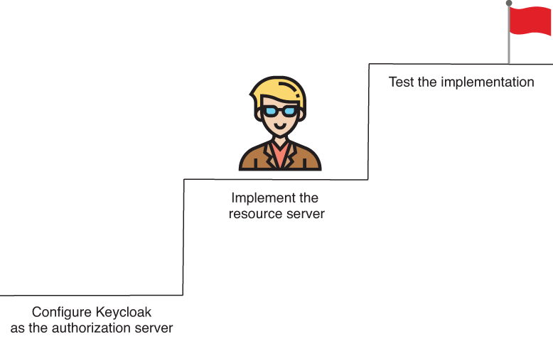
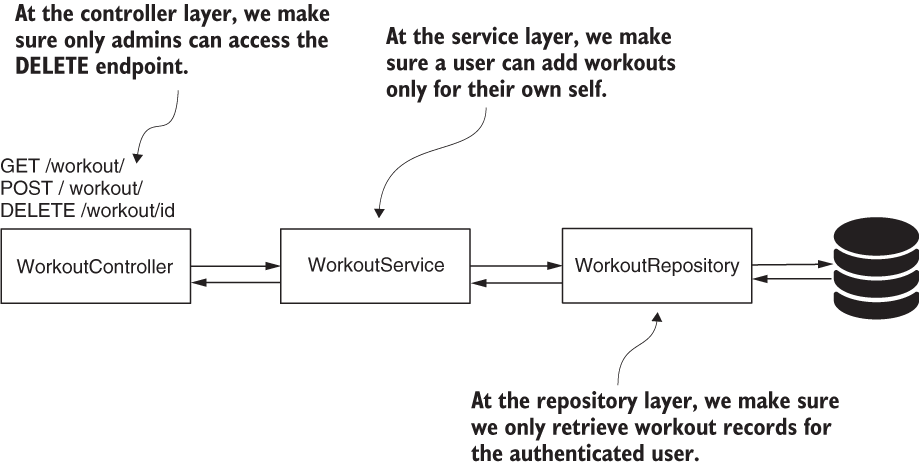
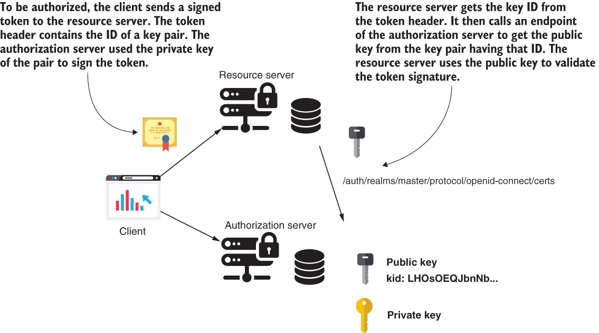

# Chapter 18 : HANDS-ON: AN OAUTH 2 APPLICATION
 
*  [https://livebook.manning.com/book/spring-security-in-action/chapter-18](https://livebook.manning.com/book/spring-security-in-action/chapter-18) 

[Amazon](https://www.amazon.com/Spring-Security-Action-Laurentiu-Spilca/dp/1617297739) | [Manning](https://www.manning.com/books/spring-security-in-action) | [YouTube](https://t.co/4Or4P12LH2?amp=1) | [Books](https://laurspilca.com/books/) | [livebook](https://livebook.manning.com/book/spring-security-in-action) 


In chapters 12 through 15, we discussed in detail how an OAuth 2 system works and how you implement one with Spring Security. We then changed the subject and in chapters 16 and 17, you learned how to apply authorization rules at any layer of your application using global method security. In this chapter, we’ll combine these two essential subjects and apply global method security within an OAuth 2 resource server.

Besides defining authorization rules at different layers of our resource server implementation, you’ll also learn how to use a tool named Keycloak as the authorization server for your system. The example we’ll work on this chapter is helpful for the following reasons:

* Systems often use third-party tools such as Keycloak in real-world implementations to define an abstraction layer for authentication. There’s a good chance you need to use Keycloak or a similar third-party tool in your OAuth 2 implementation. You’ll find many possible alternatives to ***Keycloak*** like ***Okta***,***Auth0***, and ***LoginRadius***. This chapter focuses on a scenario in which you need to use such a tool in the system you develop.
* In real-world scenarios, we use authorization applied not only for the endpoints but also for other layers of the application. And this also happens for an OAuth 2 system.
* You’ll gain a better understanding of the big picture of the technologies and approaches we discuss. To do this, we’ll once again use an example to reinforce what you learned in chapters 12 through 17.

Let’s dive into the next section and find out the scenario of the application we’ll
implement in this hands-on chapter.

## 18.3 Implementing the resource server
[https://livebook.manning.com/book/spring-security-in-action/chapter-18/98](https://livebook.manning.com/book/spring-security-in-action/chapter-18/98)
In this section, we use Spring Security to implement the resource server for our scenario.
In section 18.2, we configured Keycloak as the authorization server for the system
(figure 18.25).


| |
|-----------|
|Figure 18.25 Now that we have set the Keycloak authorization server, we start the next step in the hands-on example—implementing the resource server.|


To build the resource server, I created a new project, named ssia-ch18-ex1. The class
design is straightforward (figure 18.26) and is based on three layers: a controller, a service,
and a repository. We implement authorization rules for each of these layers.


| |
|-----------|
|Figure 18.26 The class design for the resource server. We have three layers: the controller, the service, and the repository. Depending on the implemented use case, we configure the authorization rules for one of these layers.|

We add the dependencies to the pom.xml file:
```xml
<dependency>
   <groupId>org.springframework.boot</groupId>
   <artifactId>spring-boot-starter-security</artifactId>
</dependency>
<dependency>
   <groupId>org.springframework.boot</groupId>
   <artifactId>spring-boot-starter-web</artifactId>
</dependency>
<dependency>
   <groupId>org.springframework.cloud</groupId>
   <artifactId>spring-cloud-starter-oauth2</artifactId>
</dependency>
<dependency>
   <groupId>org.springframework.boot</groupId>
   <artifactId>spring-boot-starter-data-jpa</artifactId>
</dependency>
<dependency>
   <groupId>org.springframework.security</groupId>
   <artifactId>spring-security-data</artifactId>
</dependency>
<dependency>
   <groupId>mysql</groupId>
   <artifactId>mysql-connector-java</artifactId>
   <scope>runtime</scope>
</dependency>
```

Because we store the workout details in a database, we also add the schema.sql and
data.sql files to the project. In these files, we put the SQL queries to create the database
structure and some data that we can use later when testing the application. We
only need a simple table, so our schema.sql file stores only the query to create this
table:
```sql
CREATE TABLE IF NOT EXISTS `spring`.`workout` (
  `id` INT NOT NULL AUTO_INCREMENT,
  `user` VARCHAR(45) NULL,
  `start` DATETIME NULL,
  `end` DATETIME NULL,
  `difficulty` INT NULL,
  PRIMARY KEY (`id`));
```

We also need some records in the workout table to test the application. To add these
records, you write some INSERT queries in the data.sql file:
```sql
INSERT IGNORE INTO `spring`.`workout` 
(`id`, `user`, `start`, `end`, `difficulty`) VALUES 
(1, 'bill', '2020-06-10 15:05:05', '2020-06-10 16:10:07', '3');

INSERT IGNORE INTO `spring`.`workout` 
(`id`, `user`, `start`, `end`, `difficulty`) VALUES 
(2, 'rachel', '2020-06-10 15:05:10', '2020-06-10 16:10:20', '3');

INSERT IGNORE INTO `spring`.`workout` 
(`id`, `user`, `start`, `end`, `difficulty`) VALUES 
(3, 'bill', '2020-06-12 12:00:10', '2020-06-12 13:01:10', '4');

INSERT IGNORE INTO `spring`.`workout` 
(`id`, `user`, `start`, `end`, `difficulty`) VALUES 
(4, 'rachel', '2020-06-12 12:00:05', '2020-06-12 12:00:11', '4');
```

With these four INSERT statements, we now have a couple of workout records for user Bill and another two for user Rachel to use in our tests. Before starting to write our  application logic, we need to define the application.properties file. We already have the Keycloak authorization server running on port 8080, so change the port for the  resource server to 9090. Also, in the application.properties file, write the properties needed by Spring Boot to create the data source. The next code snippet shows the contents of the application.properties file:
```properties
server.port=9090
spring.datasource.url=jdbc:mysql://localhost/spring?useLegacyDatetimeCode=false&serverTimezone=UTC
spring.datasource.username=root
spring.datasource.password=
spring.datasource.initialization-mode=always
```

Now, let’s first implement the JPA entity and the Spring Data JPA repository. The next listing presents the JPA entity class named Workout.
```java
@Entity
public class Workout {

  @Id
  @GeneratedValue(strategy = GenerationType.IDENTITY)
  private int id;
  private String user;
  private LocalDateTime start;
  private LocalDateTime end;
  private int difficulty;

  // Omitted getter and setters
}
```
In listing 18.2, you find the Spring Data JPA repository interface for the ***Workout***
entity. Here, at the repository layer, we define a method to retrieve all the workout
records for a specific user from the database. As you learned in chapter 17, instead of
using ***@PostFilter***, we choose to apply the constraint directly in the query.

```java
public interface WorkoutRepository 
  extends JpaRepository<Workout, Integer> {
    //A SpEL expression retrieves the value of the authenticated username from the security context.
    @Query("SELECT w FROM Workout w WHERE  w.user = ?#{authentication.name}")
    List<Workout> findAllByUser();
}
```

Because we now have a repository, we can continue with implementing the service
class called ***WorkoutService***. Listing 18.3 presents the implementation of the ***WorkoutService***
class. The controller directly calls the methods of this class. According to
our scenario, we need to implement three methods:

* ***saveWorkout()***—Adds a new workout record in the database
* ***findWorkouts()***—Retrieves the workout records for a user
* ***deleteWorkout()***—Deletes a workout record for a given ID

```java
@Service
public class WorkoutService {

  @Autowired
  private WorkoutRepository workoutRepository;

  //By preauthorization, ensures the method isn’t called if the workout record doesn’t belong to the user
  @PreAuthorize("#workout.user == authentication.name")
  public void saveWorkout(Workout workout) {
    workoutRepository.save(workout);
  }
  
  //For this method, we already applied filtering at the repository layer.
  public List<Workout> findWorkouts() {
    return workoutRepository.findAllByUser();
  }
  
  //Applies authorization for this method at the endpoint layer
  public void deleteWorkout(Integer id) {
    workoutRepository.deleteById(id);
  }
}
```

* ***NOTE*** You may be wondering why I chose to implement the authorization rules precisely like you see in the example and not in a different way. For the ***deleteWorkout()*** method, why did I write the authorization rules at the endpoint level and not at the service layer? For this use case, I chose to do so to cover more ways for configuring authorization. It would be the same as in previous examples had I set the authorization rules for workout deletion at the service layer. And, in a more complex application, like in a real-world app, you might have restrictions that force you to choose a specific layer.

The controller class only defines the endpoints, which further call the service methods.
The following listing presents the implementation of the controller class.

```java
@RestController
@RequestMapping("/workout")
public class WorkoutController {

  @Autowired
  private WorkoutService workoutService;

  @PostMapping("/")
  public void add(@RequestBody Workout workout) {
    workoutService.saveWorkout(workout);
  }

  @GetMapping("/")
  public List<Workout> findAll() {
    return workoutService.findWorkouts();
  }

  @DeleteMapping("/{id}")
  public void delete(@PathVariable Integer id) {
    workoutService.deleteWorkout(id);
  }
}
```

The last thing we need to define to have a complete application is the configuration class. We need to choose the way the resource server validates tokens issued by the authorization server. We discussed three approaches in chapters 14 and 15:
* With a direct call to the authorization server
* Using a blackboarding approach
* With cryptographic signatures

Because we already know the authorization server issues JWTs, the most comfortable choice is to rely on the cryptographic signature of the token. As you know from chapter 15, we need to provide the resource server the key to validate the signature. Fortunately, Keycloak offers an endpoint where public keys are exposed:

```
http://localhost:8080/auth/realms/master/protocol/openid-connect/certs
```

We add this URI, together with the value of the aud claim we set on the token in the application.properties file:
```properties
server.port=9090

spring.datasource.url=jdbc:mysql://localhost/spring
spring.datasource.username=root
spring.datasource.password=
spring.datasource.initialization-mode=always
claim.aud=fitnessapp
jwkSetUri=http://localhost:8080/auth/realms/master/protocol/openid-connect/certs
```

Now we can write the configuration file. For this, the following listing shows our configuration class.

```java
@Configuration
@EnableResourceServer
@EnableGlobalMethodSecurity(prePostEnabled = true)  //Enables global method security pre-/postannotations
public class ResourceServerConfig
  extends ResourceServerConfigurerAdapter {   //Extends the ResourceServerConfigurerAdapter to customize the resource server configurations

  @Value("${claim.aud}")   //Injects from the context the key’s URI and the aud claim value
  private String claimAud;

  @Value("${jwkSetUri}")   //Injects from the context the key’s URI and the aud claim value
  private String urlJwk;

  @Override             //Sets up the token store and the value expected for the aud claim   
  public void configure(ResourceServerSecurityConfigurer resources) {
    resources.tokenStore(tokenStore());
    resources.resourceId(claimAud);
  }

  @Bean
  public TokenStore tokenStore() {
    //Creates the TokenStore bean that verifies tokens based on the keys found at the provided URI
    return new JwkTokenStore(urlJwk);
  }
}
```
To create an instance of ***TokenStore***, we use an implementation called ***JwkTokenStore***. This implementation uses an endpoint where we can expose multiple keys. To
validate a token, ***JwkTokenStore*** looks for a specific key whose ID needs to exist in
the header of the provided JWT token (figure 18.27).

| |
|-----------|
|Figure 18.27 The authorization server uses a private key to sign the token. When it signs the token, the authorization server also adds an ID of the key pair in the token header. To validate the token, the resource server calls an endpoint of the authorization server and gets the public key for the ID found in the token header. The resource server uses this public key to validate the token signature. |


* ***NOTE*** Remember, we took the path /openid-connect/certs to the endpoint
from Keycloak, where Keycloak exposed the key, at the beginning of the
chapter. You may find other tools to use a different path for this endpoint.

If you call the keys URI, you see something similar to the next code snippet. In the
HTTP response body, you have multiple keys. We call this collection of keys the ***key set***.
Each key has multiple attributes, including the value of the key and a unique ID for
each key. The attribute kid represents the key ID in the JSON response.

```json
{
  "keys":[
    {
     "kid":"LHOsOEQJbnNbUn8PmZXA9TUoP56hYOtc3VOk0kUvj5U", //The ID of the key
     "kty":"RSA",
     "alg":"RS256",
     "use":"sig",
      ...
    }
  ...
  ]
}
```

The JWT needs to specify which key ID is used to sign the token. The resource server needs to find the key ID in the JWT header. If you generate a token with our resource 
server as we did in section 18.2 and decode the header of the token, you can see the token contains the key ID as expected. In the next code snippet, you find the decoded
header of a token generated with our Keycloak authorization server:
```json
{
"alg": "RS256",
"typ": "JWT",
"kid": "LHOsOEQJbnNbUn8PmZXA9TUoP56hYOtc3VOk0kUvj5U"
}
```

To complete our configuration class, let’s add the authorization rules for the endpoint level and the SecurityEvaluationContextExtension. Our application needs this
extension to evaluate the SpEL expression we used at the repository layer. The final configuration class looks as presented in the following listing.

Listing 18.6 The configuration class
```java
@Configuration
@EnableResourceServer
@EnableGlobalMethodSecurity(prePostEnabled = true)
public class ResourceServerConfig 
  extends ResourceServerConfigurerAdapter {

  @Value("${claim.aud}")
  private String claimAud;

  @Value("${jwkSetUri}")
  private String urlJwk;

  @Override
  public void configure(ResourceServerSecurityConfigurer resources) {
    resources.tokenStore(tokenStore());
    resources.resourceId(claimAud);
  }

  @Bean
  public TokenStore tokenStore() {
    return new JwkTokenStore(urlJwk);
  }

  @Override
  public void configure(HttpSecurity http) throws Exception {
    http.authorizeRequests()
        .mvcMatchers(HttpMethod.DELETE, "/**")
            .hasAuthority("fitnessadmin")
        .anyRequest().authenticated();
  }

  @Bean
  public SecurityEvaluationContextExtension 
    securityEvaluationContextExtension() {

    return new SecurityEvaluationContextExtension();
  }
}
```