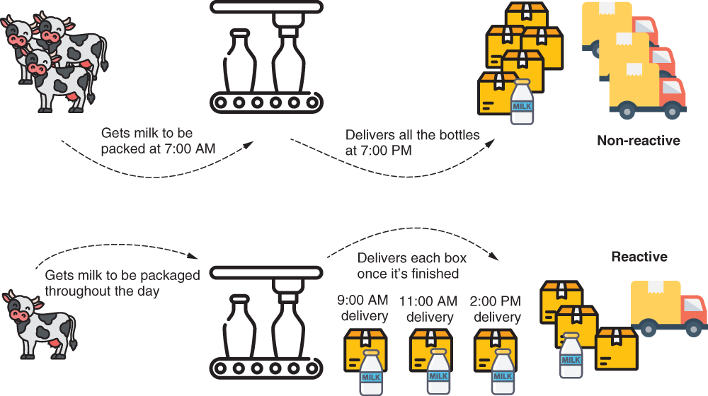

# Chapter 19 : SPRING SECURITY FOR REACTIVE APPS
 

[Amazon](https://www.amazon.com/Spring-Security-Action-Laurentiu-Spilca/dp/1617297739) | [Manning](https://www.manning.com/books/spring-security-in-action) | [YouTube](https://t.co/4Or4P12LH2?amp=1) | [Books](https://laurspilca.com/books/) | [livebook](https://livebook.manning.com/book/spring-security-in-action) 

[https://livebook.manning.com/book/spring-security-in-action/chapter-19](https://livebook.manning.com/book/spring-security-in-action/chapter-19)

***Reactive*** is a programming paradigm where we apply a different way of thinking
when developing our applications. Reactive programming is a powerful way of
developing web apps that has gained wide acceptance. I would even say that it
became fashionable a few years ago when any important conference had at least a
few presentations discussing reactive apps. But like any other technology in software
development, reactive programming doesn’t represent a solution applicable
to every situation.

In some cases, a reactive approach is an excellent fit. In other cases, it might
only complicate your life. But, in the end, the reactive approach exists because it
addresses some limitations of imperative programming, and so is used to avoid
such limitations. One of these limitations involves executing large tasks that can
somehow be fragmented. With an imperative approach, you give the application a
task to execute, and the application has the responsibility to solve it. If the task is
large, it might take a substantial amount of time for the application to solve it. The client
who assigned the task needs to wait for the task to be entirely solved before receiving
a response. With reactive programming, you can divide the task so that the app
has the opportunity to approach some of the subtasks concurrently. This way, the client
receives the processed data faster.

In this chapter, we’ll discuss implementing application-level security in reactive
applications with Spring Security. As with any other application, security is an important
aspect of reactive apps. But because reactive apps are designed differently, Spring
Security has adapted the way we implement features discussed previously in this book.

We’ll start with a short overview of implementing reactive apps with the Spring
framework in section 19.1. Then, we’ll apply the security features you learned
throughout this book on security apps. In section 19.2, we’ll discuss user management
in reactive apps, and in section 19.3, w’lle continue with applying authorization rules.
Finally, in section 19.4, you’ll learn how to implement reactive applications in a system
designed over OAuth 2. You’ll learn what changes from the Spring Security perspective
when it comes to reactive applications, and of course, you’ll learn how to apply
this with examples.

## 19.1 What are reactive apps?
In this section, we briefly discuss reactive apps. This chapter is about applying security for reactive apps, so with this section, I want to make sure you grasp the essentials of reactive apps before going deeper into Spring Security configurations. Because the topic of reactive applications is big, in this section I only review the main aspects of reactive apps as a refresher. If you aren’t yet aware of how reactive apps work, or you need to understand them in more detail, I recommend you read chapter 10 of ***Spring in Action*** by Craig Walls (Manning, 2020):
```
https://livebook.manning.com/book/spring-in-action-sixth-edition/chapter-10/
```

When we implement reactive apps, we use two fashions to implement the functionalities. The following list elaborates on these approaches:

* ***With the imperative approach, your app processes the bulk of your data all at once***. For example, a client app calls an endpoint exposed by the server and sends all the data that needs to be processed to the backend. Say you implement a functionality where the user uploads files. If the user selects a number of files, and all of these are received by the backend app to be processed all at once, you’re working with an imperative approach.

* ***With the reactive approach, your app receives and processes the data in fragments***. Not all the data has to be fully available from the beginning to be processed. The backend receives and processes data as it gets it. Say the user selects some files, and the backend needs to upload and process them. The backend doesn’t wait to receive all the files at once before processing. The backend might receive the files one by one and  process each while waiting for more files to come.


Figure 19.1 presents an analogy for the two programming approaches. Imagine a factory
bottling milk. If the factory gets all the milk in the morning, and once it finishes
the bottling, it delivers the milk, then we say it’s non-reactive (imperative). If the factory
gets the milk throughout the day, and once it finishes bottling enough milk for an
order, it delivers the order, then we say it’s reactive. Clearly, for the milk factory, it’s
more advantageous to use a reactive approach rather than a non-reactive one.


| |
|-----------|
| Figure 19.1 Non-reactive vs. reactive. In a non-reactive approach, the milk factory gets all the milk to be packaged in the morning and delivers all the boxes in the evening. In a reactive approach, as the milk is brought to the factory, it’s packaged and then delivered. For this scenario, a reactive approach is better as it allows milk to be collected throughout the day and delivered sooner to the clients.|

For implementing reactive apps, the Reactive Streams specification (http://www.reactive-streams.org/) provides a standard way for asynchronous stream processing. One
of the implementations of this specification is the Project Reactor, which builds the
foundations of Spring’s reactive programming model. Project Reactor provides a
functional API for composing Reactive Streams.

To get a more hands-on feeling, let’s start a simple implementation of a reactive
app. We’ll continue further with this same application in section 19.2 when discussing
user management in reactive apps. I created a new project named ssia-ch19-ex1, and
we’ll develop a reactive web app that exposes a demo endpoint. In the pom.xml file,
we need to add the reactive web dependency as presented in the next code snippet.