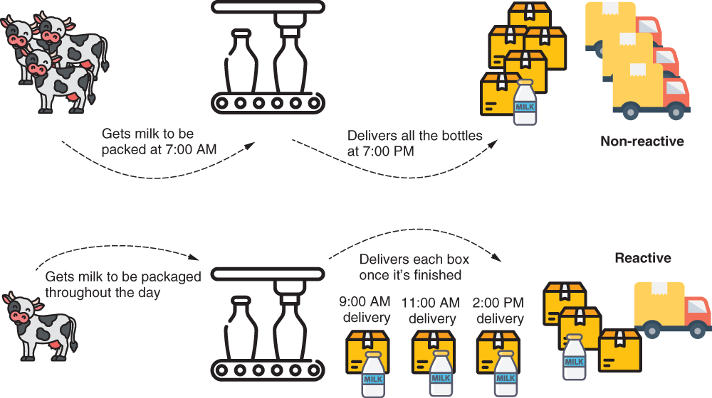
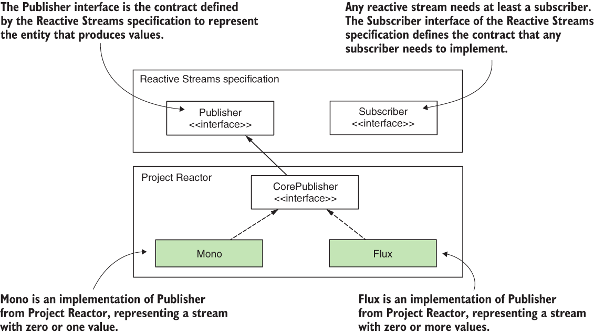
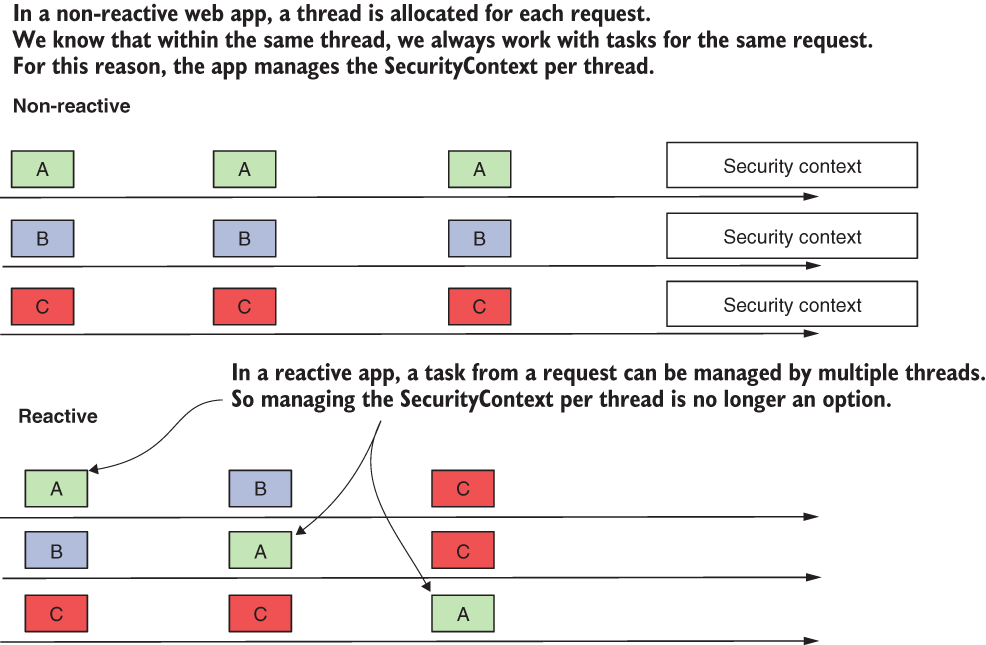
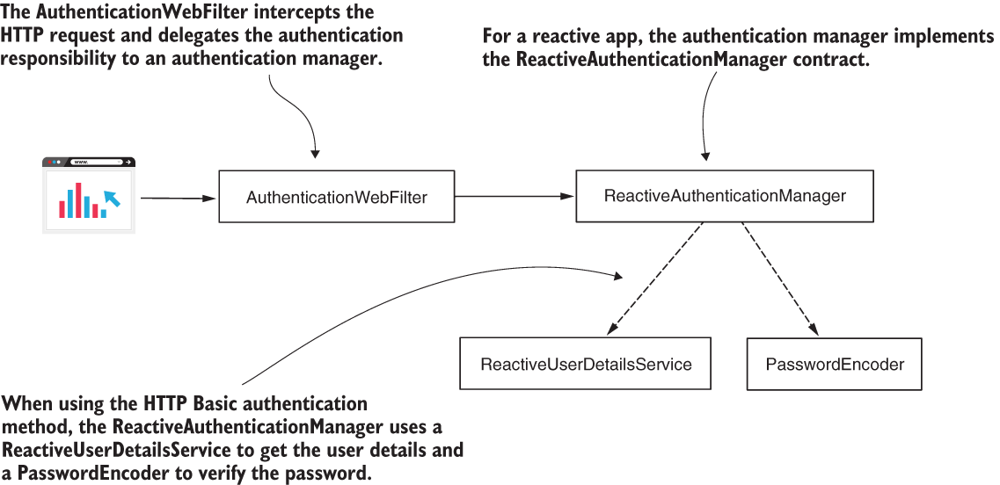

# Chapter 19 : SPRING SECURITY FOR REACTIVE APPS
 

[Amazon](https://www.amazon.com/Spring-Security-Action-Laurentiu-Spilca/dp/1617297739) | [Manning](https://www.manning.com/books/spring-security-in-action) | [YouTube](https://t.co/4Or4P12LH2?amp=1) | [Books](https://laurspilca.com/books/) | [livebook](https://livebook.manning.com/book/spring-security-in-action) 

[https://livebook.manning.com/book/spring-security-in-action/chapter-19](https://livebook.manning.com/book/spring-security-in-action/chapter-19)

***Reactive*** is a programming paradigm where we apply a different way of thinking
when developing our applications. Reactive programming is a powerful way of
developing web apps that has gained wide acceptance. I would even say that it
became fashionable a few years ago when any important conference had at least a
few presentations discussing reactive apps. But like any other technology in software
development, reactive programming doesn’t represent a solution applicable
to every situation.

In some cases, a reactive approach is an excellent fit. In other cases, it might
only complicate your life. But, in the end, the reactive approach exists because it
addresses some limitations of imperative programming, and so is used to avoid
such limitations. One of these limitations involves executing large tasks that can
somehow be fragmented. With an imperative approach, you give the application a
task to execute, and the application has the responsibility to solve it. If the task is
large, it might take a substantial amount of time for the application to solve it. The client
who assigned the task needs to wait for the task to be entirely solved before receiving
a response. With reactive programming, you can divide the task so that the app
has the opportunity to approach some of the subtasks concurrently. This way, the client
receives the processed data faster.

In this chapter, we’ll discuss implementing application-level security in reactive
applications with Spring Security. As with any other application, security is an important
aspect of reactive apps. But because reactive apps are designed differently, Spring
Security has adapted the way we implement features discussed previously in this book.

We’ll start with a short overview of implementing reactive apps with the Spring
framework in section 19.1. Then, we’ll apply the security features you learned
throughout this book on security apps. In section 19.2, we’ll discuss user management
in reactive apps, and in section 19.3, w’lle continue with applying authorization rules.
Finally, in section 19.4, you’ll learn how to implement reactive applications in a system
designed over OAuth 2. You’ll learn what changes from the Spring Security perspective
when it comes to reactive applications, and of course, you’ll learn how to apply
this with examples.

## 19.1 What are reactive apps?
In this section, we briefly discuss reactive apps. This chapter is about applying security for reactive apps, so with this section, I want to make sure you grasp the essentials of reactive apps before going deeper into Spring Security configurations. Because the topic of reactive applications is big, in this section I only review the main aspects of reactive apps as a refresher. If you aren’t yet aware of how reactive apps work, or you need to understand them in more detail, I recommend you read chapter 10 of ***Spring in Action*** by Craig Walls (Manning, 2020):
```
https://livebook.manning.com/book/spring-in-action-sixth-edition/chapter-10/
```

When we implement reactive apps, we use two fashions to implement the functionalities. The following list elaborates on these approaches:

* ***With the imperative approach, your app processes the bulk of your data all at once***. For example, a client app calls an endpoint exposed by the server and sends all the data that needs to be processed to the backend. Say you implement a functionality where the user uploads files. If the user selects a number of files, and all of these are received by the backend app to be processed all at once, you’re working with an imperative approach.

* ***With the reactive approach, your app receives and processes the data in fragments***. Not all the data has to be fully available from the beginning to be processed. The backend receives and processes data as it gets it. Say the user selects some files, and the backend needs to upload and process them. The backend doesn’t wait to receive all the files at once before processing. The backend might receive the files one by one and  process each while waiting for more files to come.


Figure 19.1 presents an analogy for the two programming approaches. Imagine a factory
bottling milk. If the factory gets all the milk in the morning, and once it finishes
the bottling, it delivers the milk, then we say it’s non-reactive (imperative). If the factory
gets the milk throughout the day, and once it finishes bottling enough milk for an
order, it delivers the order, then we say it’s reactive. Clearly, for the milk factory, it’s
more advantageous to use a reactive approach rather than a non-reactive one.


| |
|-----------|
| Figure 19.1 Non-reactive vs. reactive. In a non-reactive approach, the milk factory gets all the milk to be packaged in the morning and delivers all the boxes in the evening. In a reactive approach, as the milk is brought to the factory, it’s packaged and then delivered. For this scenario, a reactive approach is better as it allows milk to be collected throughout the day and delivered sooner to the clients.|

For implementing reactive apps, the Reactive Streams specification (http://www.reactive-streams.org/) provides a standard way for asynchronous stream processing. One
of the implementations of this specification is the Project Reactor, which builds the
foundations of Spring’s reactive programming model. Project Reactor provides a
functional API for composing Reactive Streams.

To get a more hands-on feeling, let’s start a simple implementation of a reactive
app. We’ll continue further with this same application in section 19.2 when discussing
user management in reactive apps. I created a new project named ssia-ch19-ex1, and
we’ll develop a reactive web app that exposes a demo endpoint. In the pom.xml file,
we need to add the reactive web dependency as presented in the next code snippet.

This dependency houses the Project Reactor and enables us to use its related classes
and interfaces in our project:
```xml
<dependency>
    <groupId>org.springframework.boot</groupId>
    <artifactId>spring-boot-starter-webflux</artifactId>
</dependency>
```

Next, we define a simple ***HelloController*** to hold the definition of our demo endpoint.
Listing 19.1 shows the definition of the ***HelloController*** class. In the definition
of the endpoint, you’ll observe I used as a return type a ***Mono***. ***Mono*** is one of the
essential concepts defined by a Reactor implementation. When working with Reactor,
you often use ***Mono*** and ***Flux***, which both define publishers (sources of data). In the
Reactive Streams specification, a publisher is described by the ***Publisher*** interface.
This interface describes one of the essential contracts used with Reactive Streams. The
other contract is the ***Subscriber***. This contract describes the component consuming
the data.

When designing an endpoint that returns something, the endpoint becomes a
publisher, so it has to return a ***Publisher*** implementation. If using Project Reactor,
this will be a ***Mono*** or a ***Flux***. ***Mono*** is a publisher for a single value, while Flux is a
publisher for multiple values. Figure 19.2 describes these components and the relationships
among these.

| |
|-----------|
| Figure 19.2 In a reactive stream, a publisher produces values, and a subscriber consumes those values. Contracts defined by the Reactive Streams specification describe publishers and subscribers. Project Reactor implements the Reactive Streams specification and implements the Publisher and Subscriber contracts. In the figure, the components we use in the examples in this chapter are shaded.|

To make this explanation even more precise, let’s go back to the milk factory analogy.
The milk factory is a reactive backend implementation that exposes an endpoint to
receive the milk to be processed. This endpoint produces something (bottled milk),
so it needs to return a ***Publisher***. If more than one bottle of milk is requested, then
the milk factory needs to return a ***Flux***, which is Project Reactor’s publisher implementation
that deals with zero or more produced values.

```java
@RestController
public class HelloController {

  @GetMapping("/hello")
  public Mono<String> hello() {
    return Mono.just("Hello!"); //Creates and returns a Mono stream source with one value on the stream
  }
}
```
You can now start and test the application. The first thing you observe by looking in
the app’s terminal is that Spring Boot doesn’t configure a Tomcat server anymore.
Spring Boot used to configure a Tomcat for a web application by default, and you may
have observed this aspect in any of the examples we previously developed in this book.
Instead, now Spring Boot autoconfigures Netty as the default reactive web server for a
Spring Boot project.

The second thing you may have observed when calling the endpoint is that it
doesn’t behave differently from an endpoint developed with a non-reactive approach.
You can still find in the HTTP response body the ***Hello!*** message that the endpoint
returns in its defined ***Mono*** stream. The next code snippet presents the app’s behavior
when calling the endpoint:
```bash
curl http://localhost:8080/hello
```

The response body is
```
Hello!
```
But why is the reactive approach different in terms of Spring Security? Behind the
scenes, a reactive implementation uses multiple threads to solve the tasks on the
stream. In other words, it changes the philosophy of one-thread-per-request, which we
use for a web app designed with an imperative approach (figure 19.3). And, from
here, more differences:

* The ***SecurityContext*** implementation doesn’t work the same way in reactive
applications. Remember, the ***SecurityContext*** is based on a ***ThreadLocal***,
and now we have more than one thread per request. (We discussed this component
in chapter 5.)

* Because of the ***SecurityContext***, any authorization configuration is now
affected. Remember that the authorization rules generally rely on the ***Authentication***
instance stored in the ***SecurityContext***. So now, the security configurations
applied at the endpoint layer as well as the global method security
functionality are affected.

* The ***UserDetailsService***, the component responsible for retrieving the user
details, is a data source. Because of this, the user details service also needs to
support a reactive approach. (We learned about this contract in chapter 2.)

| |
|-----------|
| Figure 19.3 In the figure, each arrow represents the timeline of a different thread, and squares represent the processed tasks from requests A, B, and C. Because in a reactive app, tasks from one request might be handled on multiple threads, the authentication details cannot be stored at the thread level anymore.|

Fortunately, Spring Security offers support for reactive apps and covers all cases in
which you can’t use the implementations for non-reactive apps anymore. We’ll continue
in this chapter by discussing the way you implement security configurations with
Spring Security for reactive apps. We’ll start in section 19.2 with implementing user
management and continue in section 19.3 with applying endpoint authorization
rules, where we’ll find out how security context works in reactive apps. We’ll then continue
our discussion with reactive method security, which replaces the global method
security of imperative apps.

## 19.2 User management in reactive apps
Often in applications, the way a user authenticates is based on a pair of username and
password credentials. This approach is basic, and we discussed it, starting with the most
straightforward application we implemented in chapter 2. But with reactive apps, the
implementation of the component taking care of user management changes as well. In
this section, we discuss implementing user management in a reactive app.

We continue the implementation of the ssia-ch19-ex1 application we started in section
19.1 by adding a ***ReactiveUserDetailsService*** to the context of the application.
We want to make sure the /hello endpoint can be called only by an
authenticated user. As its name suggests, the ***ReactiveUserDetailsService*** contract
defines the user details service for a reactive app.

The definition of the contract is as simple as the one for ***UserDetailsService***.
The ***ReactiveUserDetailsService*** defines a method used by Spring Security to
retrieve a user by its username. The difference is that the method described by the
***ReactiveUserDetailsService*** directly returns a ***Mono<UserDetails>*** and not
the UserDetails as happens for UserDetailsService. The next code snippet
shows the definition of the ***ReactiveUserDetailsService*** interface:
```java
public interface ReactiveUserDetailsService {
    Mono<UserDetails> findByUsername(String username);
}
```

As in the case of the ***UserDetailsService***, you can write a custom implementation
of the ***ReactiveUserDetailsService*** to give Spring Security a way to obtain the
user details. To simplify this demonstration, we use an implementation provided by
Spring Security. The ***MapReactiveUserDetailsService*** implementation stores the
user details in memory (same as the ***InMemoryUserDetailsManager*** that you
learned about in chapter 2). We change the pom.xml file of the ssia-ch19-ex1 project
and add the Spring Security dependency, as the next code snippet presents:

```xml
<dependency>
    <groupId>org.springframework.boot</groupId>
    <artifactId>spring-boot-starter-security</artifactId>
    </dependency>
    <dependency>
    <groupId>org.springframework.boot</groupId>
    <artifactId>spring-boot-starter-webflux</artifactId>
</dependency>
```
We then create a configuration class and add a ***ReactiveUserDetailsService*** and
a ***PasswordEncoder*** to the Spring Security context. I named the configuration class
***ProjectConfig***. You can find the definition of this class in listing 19.2. Using a
***ReactiveUserDetailsService***, we then define one user with its username ***john***,
the password ***12345***, and an authority I named ***read***. As you can observe, it’s similar
to working with a UserDetailsService. The main difference in the implementation of the ***ReactiveUserDetailsService*** is that the method returns a reactive
***Publisher*** object containing the ***UserDetails*** instead of the ***UserDetails***
instance itself. Spring Security takes the rest of the duty for integration.

Listing 19.2 The ProjectConfig class
```java
@Configuration
public class ProjectConfig {

  @Bean   //Adds a ReactiveUserDetailsService to the Spring context
  public ReactiveUserDetailsService userDetailsService() {
    var  u = User.withUsername("john")  //Creates a new user with its username, password, and authorities
              .password("12345")
              .authorities("read")
              .build();

    //Creates a MapReactiveUserDetailsService to manage the UserDetails instances
    var uds = new MapReactiveUserDetailsService(u);

    return uds;
  }

  @Bean  //Adds a PasswordEncoder to the Spring context
  public PasswordEncoder passwordEncoder() {
    return NoOpPasswordEncoder.getInstance();
  }
}
```

Starting and testing the application now, you might notice that you can call the endpoint
only when you authenticate using the proper credentials. In our case, we can
only use ***john*** with its password ***12345***, as it’s the only user record we added. The following
code snippet shows you the behavior of the app when calling the endpoint
with valid credentials:
```bash
curl -u john:12345 http://localhost:8080/hello
```
The response body is
```
Hello!
```

Figure 19.4 explains the architecture we use in this application. Behind the scenes, an
***AuthenticationWebFilter*** intercepts the HTTP request. This filter delegates the
authentication responsibility to an authentication manager. The authentication
manager implements the ***ReactiveAuthenticationManager*** contract. Unlike
non-reactive apps, we don’t have authentication providers. The ***ReactiveAuthenticationManager*** directly implements the authentication logic.

If you want to create your own custom authentication logic, implement the
***ReactiveAuthenticationManager*** interface. The architecture for reactive apps is
not much different from the one we already discussed throughout this book for nonreactive
applications. As presented in figure 19.4, if authentication involves user credentials, then we use a ***ReactiveUserDetailsService*** to obtain the user details and a ***PasswordEncoder*** to verify the password.

| |
|-----------|
| Figure 19.4  An AuthenticationWebFilter intercepts the request and delegates the authentication responsibility to a ReactiveAuthenticationManager. If the authentication logic involves users and passwords, the ReactiveAuthenticationManager uses a ReactiveUserDetailsService to find the user details and a PasswordEncoder to verify the password. |

Moreover, the framework still knows to inject an authentication instance when you
request it. You request the Authentication details by adding ***Mono\<Authentication\>***
as a parameter to the method in the controller class. Listing 19.3 presents the
changes done to the controller class. Again, the significant change is that you use reactive
publishers. Observe that we need to use ***Mono\<Authentication\>*** instead of the
plain ***Authentication*** as we used in non-reactive apps.

Listing 19.3 The HelloController class
```java
@RestController
public class HelloController {

  @GetMapping("/hello")
  public Mono<String> hello(
    Mono<Authentication> auth) {   //Requests the framework to provide the authentication object

    Mono<String> message =
      auth.map(a -> "Hello " + a.getName());  //Returns the name of the principal in the response
   
    return message;
  }
}
```
Rerunning the application and calling the endpoint, you observe the behavior is as
presented in the next code snippet:
```bash
curl -u john:12345 http://localhost:8080/hello
```
The response body is
```
Hello john
```
And now, probably your question is, where did the ***Authentication*** object come
from? Being that this is a reactive app, we can’t afford to use a ***ThreadLocal*** anymore
because the framework is designed to manage the ***SecurityContext***. But Spring
Security offers us a different implementation of the context holder for reactive apps,
***ReactiveSecurityContextHolder***. We use this to work with the ***SecurityContext*** in a reactive app. So we still have the SecurityContext, but now it’s managed
differently. Figure 19.5 describes the end of the authentication process once the
***ReactiveAuthenticationManager*** successfully authenticates the request.

