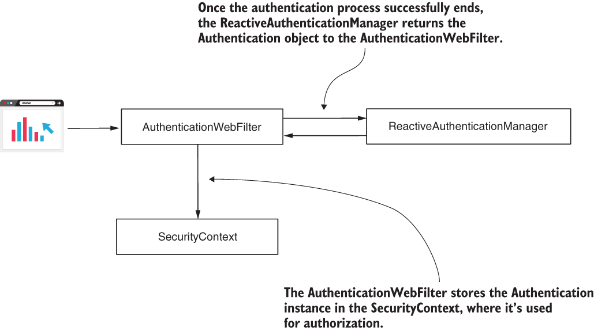

# Chapter 19 : SPRING SECURITY FOR REACTIVE APPS
 

[Amazon](https://www.amazon.com/Spring-Security-Action-Laurentiu-Spilca/dp/1617297739) | [Manning](https://www.manning.com/books/spring-security-in-action) | [YouTube](https://t.co/4Or4P12LH2?amp=1) | [Books](https://laurspilca.com/books/) | [livebook](https://livebook.manning.com/book/spring-security-in-action) 

[https://livebook.manning.com/book/spring-security-in-action/chapter-19](https://livebook.manning.com/book/spring-security-in-action/chapter-19)

## 19.2 User management in reactive apps
[https://livebook.manning.com/book/spring-security-in-action/chapter-19/55](https://livebook.manning.com/book/spring-security-in-action/chapter-19/55)

And now, probably your question is, where did the ***Authentication*** object come
from? Being that this is a reactive app, we can’t afford to use a ***ThreadLocal*** anymore
because the framework is designed to manage the ***SecurityContext***. But Spring
Security offers us a different implementation of the context holder for reactive apps,
***ReactiveSecurityContextHolder***. We use this to work with the ***SecurityContext*** in a reactive app. So we still have the SecurityContext, but now it’s managed
differently. Figure 19.5 describes the end of the authentication process once the
***ReactiveAuthenticationManager*** successfully authenticates the request.

| |
|-----------|
| Figure 19.5 Once the ReactiveAuthenticationManager successfully authenticates the request, it returns the Authentication object to the filter. The filter stores the Authentication instance in the SecurityContext.|

Listing 19.4 shows you how to rewrite the controller class if you want to get the
authentication details directly from the security context. This approach is an alternative
to allowing the framework to inject it through the method’s parameter. You find
this change implemented in project ssia-ch19-ex2.
```java
@RestController
public class HelloController {

    @GetMapping("/hello")
    public Mono<String> hello() {
      Mono<String> message =

        //From the ReactiveSecurityContextHolder, takes a Mono<SecurityContext>
        ReactiveSecurityContextHolder.getContext()         

           //Maps the SecurityContext to the Authentication object
          .map(ctx -> ctx.getAuthentication())

          //Maps the Authentication object to the returned message
          .map(auth -> "Hello " + auth.getName());

      return message;
    }
}
```
If you rerun the application and test the endpoint again, you can observe it behaves
the same as in the previous examples of this section. Here’s the command:
```bash
curl -u john:12345 http://localhost:8080/hello
```
The response body is
```
Hello john
```
Now that you know Spring Security offers an implementation to properly manage the ***SecurityContext*** in a reactive environment, you know this is how your app applies the authorization rules. And these details that you just learned open the way to configuring the authorization rules, which we’ll discuss in section 19.3.