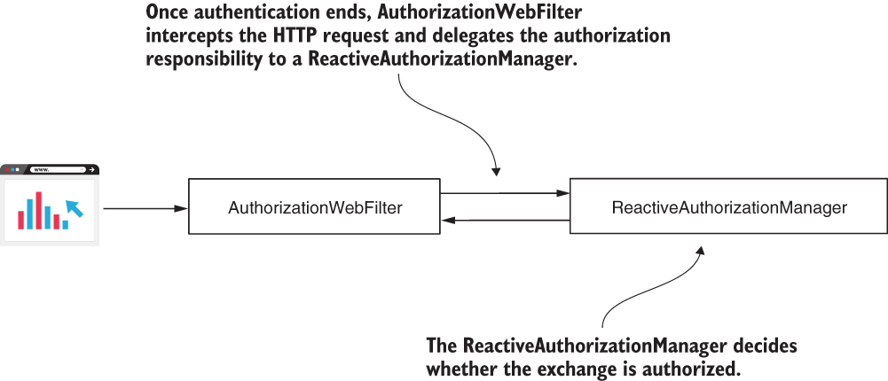

* [https://github.com/robert0714/spring_security_in_action_2020/tree/master/ssia-ch19-ex4](https://github.com/robert0714/spring_security_in_action_2020/tree/master/ssia-ch19-ex4)
*  [https://livebook.manning.com/book/spring-security-in-action/chapter-19/97](https://livebook.manning.com/book/spring-security-in-action/chapter-19/97) 

# Chapter 19 : SPRING SECURITY FOR REACTIVE APPS
 

[Amazon](https://www.amazon.com/Spring-Security-Action-Laurentiu-Spilca/dp/1617297739) | [Manning](https://www.manning.com/books/spring-security-in-action) | [YouTube](https://t.co/4Or4P12LH2?amp=1) | [Books](https://laurspilca.com/books/) | [livebook](https://livebook.manning.com/book/spring-security-in-action) 


### 19.3.1 Applying authorization at the endpoint layer in reactive apps

I told you earlier in this section that you can also use the ***access()*** method in the endpoint authorization configuration of reactive apps just as you can for non-reactive apps. But as I said when discussing the configuration of non-reactive apps in chapters 7 and 8, use the ***access()*** method only when you can’t apply your configuration otherwise.

The access() method offers you great flexibility, but also makes your app’s configuration more difficult to read. Always prefer the simpler solution over the more complex one. But you’ll find situations in which you need this flexibility. For example, suppose you need to apply a more complex authorization rule, and using **hasAuthority()*** or ***hasRole()*** and its companion methods isn’t enough. For this reason,I’ll also teach you how to use the ***access()*** method. I created a new project named ssia-ch19-ex4 for this example. In listing 19.8, you see how I built the ***SecurityWebFilterChain*** object to allow access to the /hello path only if the user has the admin role. Also, access can be done only before noon. For all other endpoints, I completely restrict access.

Listing 19.8 Using the access() method when implementing configuration rules
```java
@Configuration
public class ProjectConfig {

  // Omitted code

  @Bean
  public SecurityWebFilterChain 
    securityWebFilterChain(ServerHttpSecurity http) {
    

    return http.authorizeExchange()
        .anyExchange()
                  // For any request, applies a custom authorization rule
           .access(this::getAuthorizationDecisionMono)
        .and().httpBasic()
        .and().build();
   }

  private Mono<AuthorizationDecision>  getAuthorizationDecisionMono(
        //The method defining the custom authorization rule receives the Authentication and the request context as parameters.
            Mono<Authentication> a,   AuthorizationContext c) {

    //From the context, obtains the path of the request
    String path = getRequestPath(c);

    //Defines the restricted time
    boolean restrictedTime = LocalTime.now().isAfter(LocalTime.NOON);

    if(path.equals("/hello")) {
      //For the /hello path, applies the custom authorization rule
      return  a.map(isAdmin())
               .map(auth -> auth && !restrictedTime)
               .map(AuthorizationDecision::new);
    }
    return Mono.just(new AuthorizationDecision(false));
  }

  // Omitted code
}
```
It might look difficult, but it’s not that complicated. When you use the ***access()*** method, you provide a function receiving all possible details about the request, which are the ***Authentication*** object and the ***AuthorizationContext***. Using the ***Authentication*** object, you have the details of the authenticated user: username, roles or authorities, and other custom details depending on how you implement the authentication logic. The ***AuthorizationContext*** provides the information on the request: the path, headers, query params, cookies, and so on.

The function you provide as a parameter to the ***access()*** method should return an object of type ***AuthorizationDecision***. As you guessed, ***AuthorizationDecision*** is the answer that tells the app whether the request is allowed. When you create an instance with ***new AuthorizationDecision(true)***, it means that you allow the request. If you create it with ***new AuthorizationDecision(false)***, it  means you disallow the request.

In listing 19.9, you find the two methods I omitted in listing 19.8 for your convenience: ***getRequestPath()*** and ***isAdmin()***. By omitting these, I let you focus on the logic used by the ***access()*** method. As you can observe, the methods are simple. The ***isAdmin()*** method returns a function that returns true for an ***Authentication*** instance having the ***ROLE_ADMIN*** attribute. The ***getRequestPath()*** method simply returns the path of the request.

Listing 19.9 The definition of the getRequestPath() and isAdmin() methods
```java
@Configuration
public class ProjectConfig {

  // Omitted code

  private String getRequestPath(AuthorizationContext c) {
    return c.getExchange()
            .getRequest()
            .getPath()
            .toString();
  }

  private Function<Authentication, Boolean> isAdmin() {
    return p ->
      p.getAuthorities().stream()
       .anyMatch(e -> e.getAuthority().equals("ROLE_ADMIN"));
  }
}
```
Running the application and calling the endpoint either results in a response status 403 Forbidden if any of the authorization rules we applied aren’t fulfilled or simply displays a message in the HTTP response body:

```bash
curl -u john:12345 http://localhost:8080/hello
```
The response body is

```
Hello john
```

What happened behind the scenes in the examples in this section? When authentication ended, another filter intercepted the request. The ***AuthorizationWebFilter*** delegates the authorization responsibility to a ***ReactiveAuthorizationManager*** (figure 19.6).

| |
|-----------|
| Figure 19.6  After the authentication process successfully ends, another filter, named AuthorizationWebFilter, intercepts the request. This filter delegates the authorization responsibility to a ReactiveAuthorizationManager.|

Wait! Does this mean we only have a ***ReactiveAuthorizationManager***? How does this component know how to authorize a request based on the configurations we made? To the first question, no, there are actually multiple implementations of the ***ReactiveAuthorizationManager***. The ***AuthorizationWebFilter*** uses the SecurityWebFilterChain bean we added to the Spring context. With this bean, the filter decides which ***ReactiveAuthorizationManager*** implementation to delegate the authorization responsibility to (figure 19.7).

| |
|-----------|
| Figure 19.7  The AuthorizationFilter uses the SecurityWebFilterChain bean (shaded) that we added to the context to know which ReactiveAuthorizationManager to use.|