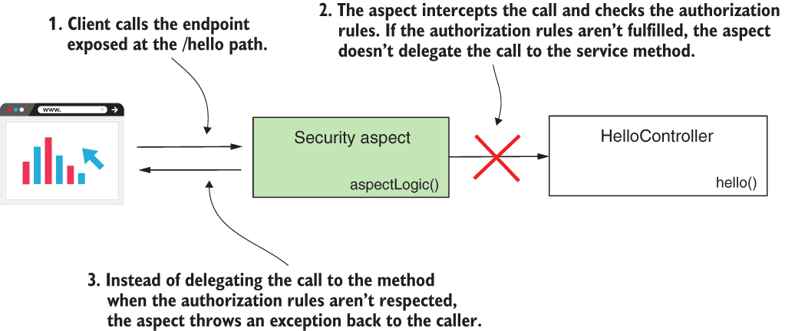

* [https://github.com/robert0714/spring_security_in_action_2020/tree/master/ssia-ch19-ex5](https://github.com/robert0714/spring_security_in_action_2020/tree/master/ssia-ch19-ex5)
*  [https://livebook.manning.com/book/spring-security-in-action/chapter-19/113](https://livebook.manning.com/book/spring-security-in-action/chapter-19/113) 

# Chapter 19 : SPRING SECURITY FOR REACTIVE APPS
 

[Amazon](https://www.amazon.com/Spring-Security-Action-Laurentiu-Spilca/dp/1617297739) | [Manning](https://www.manning.com/books/spring-security-in-action) | [YouTube](https://t.co/4Or4P12LH2?amp=1) | [Books](https://laurspilca.com/books/) | [livebook](https://livebook.manning.com/book/spring-security-in-action) 


### 19.3.2 Using method security in reactive apps
In this section, we discuss applying authorization rules for all layers of reactive apps.
For non-reactive apps, we used global method security, and in chapters 16 and 17, you
learned different approaches to apply authorization rules at the method level. Being
able to apply authorization rules at layers other than the endpoint layer offers you
great flexibility and enables you to apply authorization for non-web applications. To
teach you how to use method security for reactive apps, we work on a separate example,
which I named ssia-ch19-ex5.

Instead of global method security, when working with non-reactive apps, we call
the approach reactive method security, where we apply authorization rules directly at
the method level. Unfortunately, reactive method security isn’t a mature implementation
yet and only enables us to use the ***@PreAuthoriz***e and ***@PostAuthorize*** annotations.
When using ***@PreFilter*** and ***@PostFilter*** annotations, an issue was added
for the Spring Security team back in 2018, but it isn’t yet implemented. For more
details, see
```
https://github.com/spring-projects/spring-security/issues/5249
```

For our example, we use ***@PreAuthorize*** to validate that a user has a specific role to
call a test endpoint. To keep the example simple, we use the ***@PreAuthorize*** annotation
directly over the method defining the endpoint. But you can use it the same way
we discussed in chapter 16 for non-reactive apps: on any other component method in
your reactive application. Listing 19.10 shows the definition of the controller class.
Observe that we use @PreAuthorize, similar to what you learned in chapter 16.
Using SpEL expressions, we declare that only an admin can call the annotated
method.

Listing 19.10 The definition of the controller class
```java
@RestController
public class HelloController {

  @GetMapping("/hello")
  @PreAuthorize("hasRole('ADMIN')")  //Uses @PreAuthorize to restrict access to the method
  public Mono<String> hello() {
    return Mono.just("Hello");
  }
}
```
Here, you find the configuration class in which we use the annotation ***@EnableReactiveMethodSecurity*** to enable the reactive method security feature. Similar to global method security, we need to explicitly use an annotation to enable it. Besides this annotation, in the configuration class, you also find the usual user management definition . 
```java
@Configuration
@EnableReactiveMethodSecurity   //Enables the reactive method security feature
public class ProjectConfig {

  @Bean
  public ReactiveUserDetailsService userDetailsService() {
    var  u1 = User.withUsername("john")
            .password("12345")
            .roles("ADMIN")
            .build();

    var  u2 = User.withUsername("bill")
            .password("12345")
            .roles("REGULAR_USER")
            .build();

    var uds = new MapReactiveUserDetailsService(u1, u2);

    return uds;
  }

  @Bean
  public PasswordEncoder passwordEncoder() {
    return NoOpPasswordEncoder.getInstance();
  }
}
```
You can now start the application and test the behavior of the endpoint by calling it
for each of the users. You should observe that only John can call the endpoint because
we defined him as the admin. Bill is just a regular user, so if we try to call the endpoint
authenticating as Bill, we get back a response having the status HTTP 403 Forbidden.
Calling the /hello endpoint authenticating with user John looks like this:

```bash
curl -u john:12345 http://localhost:8080/hello
```
The response body is
```
Hello
```

Calling the /hello endpoint authenticating with user Bill looks like this:
```bash
curl -u bill:12345 http://localhost:8080/hello
```
The response body is
```
Denied
```
Behind the scenes, this functionality works the same as for non-reactive apps. In chapters 16 and 17, you learned that an aspect intercepts the call to the method and implements the authorization. If the call doesn’t fulfill the specified prepreauthorization rules, the aspect doesn’t delegate the call to the method (figure 19.8).

| |
|-----------|
| Figure 19.8  When using method security, an aspect intercepts the call to a protected method. If the call doesn’t fulfill the preauthorization rules, the aspect doesn’t delegate the call to the method.|